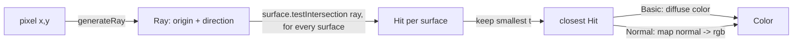

# Part 1 Guide: Basic Ray Tracing

A step-by-step walkthrough for implementing `src/main/java/cgraytracing/studentwork/Part1.java`.

**How to use this**: each step gives you the concept, the exact API you'll touch, and a way to verify
you got it right before moving on. It deliberately stops short of finished code for the four
methods below — per the assignment's Honor Code, the implementation has to be yours. Sign
conventions and edge cases are flagged as things to *derive and check*, not given outright.

## 0. Setup checklist

- [ ] Set `studentAuthorName` in `Part1.java` to your real name (0 credit otherwise).
- [ ] Build/run: open the project in IntelliJ and run the `cgraytracing.RayTracing` main class.
- [ ] Run `Part1Test` anytime from the IDE's test runner (right-click the file > Run).
- [ ] Confirm you're on **Scene Bank 1** (`Shift+1` if not) and scenes 1–5 selectable via `1`–`5`.
- [ ] Renderer keys: `z` Processing (reference), `x` Basic (yours), `c` Normal (yours).
- [ ] Camera keys you'll use to sanity-check `generateRay`: `w/a/s/d` move, `i/k` pitch,
      `j/l` yaw, `u/o` roll, `,`/`.` FOV. Watch the green `camPos/camFwd/camUp/camRight` debug text.

## 1. The data flow



`renderPixelBasic`/`renderPixelNormal` are called once per pixel by `BasicRenderer`/`NormalRenderer`
(row-major, `(0,0)` = top-left). You write both the ray generation and the per-pixel shading; the
renderer loop itself is already done for you.

## 2. API cheat sheet

| Class | Relevant members |
|---|---|
| `Ray` | `getOrigin()`, `getDirection()` (unnormalized copy), `getDirectionNormalized()`, `evaluate(t)` = `origin + direction*t` |
| `Hit` | `new Hit()` = no-hit (`t = +Infinity`); `new Hit(ray, surface, t, normal)` = hit (normal is normalized for you); `didHit()`, `getT()`, `getNormal()`, `getHitLocation()` |
| `Camera` | `getPosition()`, `getForward()/getUp()/getRight()` (all normalized), `getFov()` (**vertical**, radians) |
| `AABox` | `getMin()`, `getMax()` (min ≤ max per component, guaranteed) |
| `Surface` | `testIntersection(ray)` — **call this**, never `Part1.testAABoxIntersection` directly |
| `Color` | `new Color(r,g,b)` — floats auto-clamped to `[0,1]` |
| `Material` (via `hit.getHitSurface().getMaterial()`) | `getDiffuseColor()` |
| `MathHelper` | `nanMin`/`nanMax` — min/max that ignore `NaN` instead of propagating it |

## 3. `generateRay`

**Goal**: shoot a ray from the camera through the center of pixel `(x, y)`, direction unnormalized.

**Concept** (pinhole camera):
1. Convert `fov` (vertical, radians) into a half-height at distance 1 along `camFwd`: $h = \tan(fov / 2)$.
2. Half-width comes from the output aspect ratio: $w = h \cdot \dfrac{\text{outputWidth}}{\text{outputHeight}}$.
3. Map the pixel to normalized screen coordinates in $[-1, 1]$, **sampling the pixel center**
   (`x + 0.5`, `y + 0.5`), not the corner.
4. Scale `camRight` by the horizontal screen coordinate and `camUp` by the vertical one, then add
   both to `camFwd`. That sum (not normalized) is your ray direction; `camera.getPosition()` is
   the origin.

**Pseudocode**:

```
function generateRay(camera, outputWidth, outputHeight, x, y):
    h = tan(camera.fov / 2)
    w = h * outputWidth / outputHeight

    u = (x + 0.5) / outputWidth        # in [0, 1]
    v = (y + 0.5) / outputHeight       # in [0, 1]

    screenX = (2*u - 1) * w            # in [-w, w]
    screenY = ±(2*v - 1) * h           # in [-h, h] — pick the sign that matches your image
                                       # orientation (see 'where students go wrong' below)

    direction = camera.forward + screenX * camera.right + screenY * camera.up  # do NOT normalize
    origin = camera.position
    return Ray(origin, direction)
```

**Where students usually go wrong**:
- Forgetting the `+0.5` offset (pixels 0 and `width-1` end up off-center).
- Sign of the vertical term — because image-space `y` grows downward but `camUp` points up, one of
  the two mappings needs a flip. The PDF's hint applies literally here: if the image renders
  upside-down or mirrored, flip a sign in this step.
- Normalizing the result. Don't — `generateRay_unnormalized` in the test file specifically checks
  that corner-pixel rays have magnitude `> 1`.

**Verify**:
- Run `generateRay_basic` — center pixel direction should point along `camFwd`.
- Run `generateRay_unnormalized` — corner pixel direction magnitude `> 1`.
- Visually: switch to Basic renderer once step 5 is done, rotate/move the camera, and flip to the
  Processing renderer (`z`) to confirm both show the same framing.

## 4. `testAABoxIntersection`

**Goal**: ray/AABB intersection via the slab method, called through `AABox.testIntersection(ray)`.

**Concept**: for each axis $a \in \{x, y, z\}$, the ray enters and exits the pair of planes
$a = min_a$ and $a = max_a$ at:

$$t_1 = \frac{min_a - o_a}{d_a}, \qquad t_2 = \frac{max_a - o_a}{d_a}$$

Per axis, $t_{near} = \min(t_1, t_2)$ and $t_{far} = \max(t_1, t_2)$. Across all three axes, the box
is hit where the slabs overlap:

$$t_{enter} = \max(t_{near,x}, t_{near,y}, t_{near,z}), \qquad t_{exit} = \min(t_{far,x}, t_{far,y}, t_{far,z})$$

No intersection if $t_{enter} > t_{exit}$, or if $t_{exit} < 0$ (box entirely behind the ray).

**Pseudocode**:

```
function testAABoxIntersection(ray, box):
    tEnter = -Infinity
    tExit  = +Infinity
    enterAxis = none

    for axis in {x, y, z}:
        o = ray.origin[axis]
        d = ray.direction[axis]

        t1 = (box.min[axis] - o) / d
        t2 = (box.max[axis] - o) / d
        tNear = nanMin(t1, t2)
        tFar  = nanMax(t1, t2)

        if tNear > tEnter:
            tEnter = tNear
            enterAxis = axis          # remember which axis produced the entry, for the normal
        tExit = nanMin(tExit, tFar)

    if tEnter > tExit or tExit < 0:
        return new Hit()             # miss

    t = tEnter
    if t < 0:
        t = 0                        # origin inside/on the box — spec forbids negative t

    normal = unit vector along enterAxis, signed to oppose ray.direction
    return new Hit(ray, box, t, normal)
```

**Where students usually go wrong**:
- **Zero direction components.** If `d_a == 0` and the ray origin is outside that slab, you get a
  division producing `Infinity` with the correct sign — that's fine and self-corrects in the
  min/max. But `0/0` produces `NaN`, which silently poisons a plain `Math.min`/`Math.max`. This is
  exactly why `MathHelper.nanMin`/`nanMax` exist — use them when combining slab results.
- **Ray origin inside/on the box.** `t_enter` will be negative. The spec explicitly forbids
  returning a negative `t`, so clamp it (don't reject the hit and don't use `t_exit` instead).
- **Normal direction**: whichever axis produced `t_enter`, the normal is $\pm$ the unit vector along
  that axis — pick the sign that points against the incoming ray (opposes `ray.getDirection()`).
  `Hit`'s constructor normalizes it for you, so you only need to get the axis and sign right.
- Return `new Hit()` (not `null`) for misses.

**Verify**:
- Run `testAABoxIntersection_basic` — checks `t`, and that the normal is anti-parallel to the ray
  direction.
- Run `testAABoxIntersection_ray_inside` — checks `didHit()` is `true` for an origin-inside-box case.

## 5. `renderPixelBasic`

**Goal**: tie `generateRay` + `testAABoxIntersection` together.

**Steps**:
1. `generateRay(camera, outputWidth, outputHeight, x, y)`.
2. For every `surface` in `scene.getSurfaces()`, call `surface.testIntersection(ray)`.
3. Track the `Hit` with the smallest `t` across all surfaces (`Hit()`'s default `t` is `+Infinity`,
   so a running "best hit" initialized to `new Hit()` compares naturally).
4. If the best hit's `t` is finite, return `hit.getHitSurface().getMaterial().getDiffuseColor()`;
   otherwise return `scene.getBackgroundColor()`.

**Pseudocode**:

```
function renderPixelBasic(scene, outputWidth, outputHeight, x, y):
    ray = generateRay(scene.camera, outputWidth, outputHeight, x, y)

    best = new Hit()                       # t = +Infinity
    for surface in scene.surfaces:
        hit = surface.testIntersection(ray)
        if hit.t < best.t:
            best = hit

    if best.didHit():
        return best.hitSurface.material.diffuseColor
    else:
        return scene.backgroundColor
```

**Verify**: switch to Basic renderer (`x`) on scenes 1–6 (part1 bank) and compare against the
`Scenes` section of `ray_tracing.pdf` — flat-colored shapes on a blue background, no shading, no
inter-object occlusion errors. Move/rotate the camera and diff against the Processing renderer (`z`).

## 6. `renderPixelNormal`

**Goal**: same as above, but visualize normals instead of material color; background is black.

**Steps**: reuse the intersection loop from step 5. On a hit, map the normal's components from
`[-1, 1]` to `[0, 1]` — $c = (n + 1) / 2$ per component, `x→r`, `y→g`, `z→b`. On a miss, return black
(already given to you as `backgroundColor` in the stub — don't swap in the scene's background here).

**Pseudocode**:

```
function renderPixelNormal(scene, outputWidth, outputHeight, x, y):
    ray = generateRay(scene.camera, outputWidth, outputHeight, x, y)

    best = new Hit()
    for surface in scene.surfaces:
        hit = surface.testIntersection(ray)
        if hit.t < best.t:
            best = hit

    if best.didHit():
        n = best.normal                    # already normalized by Hit
        return Color((n.x+1)/2, (n.y+1)/2, (n.z+1)/2)
    else:
        return Color(0, 0, 0)              # black, not scene.backgroundColor
```

**Verify**: switch to Normal renderer (`c`) on scenes 3 and 6; compare against the last two images
in the PDF's `Scenes` section (colored faces on black, matching each face's outward direction).

## 7. Full verification pass

Before generating submission images, run through all of this once:

- [ ] `Part1Test` — all green in the IDE test runner.
- [ ] Scenes 1–6 (part1 bank), Basic renderer, match the PDF images.
- [ ] Scenes 3 and 6, Normal renderer, match the PDF images.
- [ ] `i/k/j/l/u/o` rotate the camera correctly; `w/a/s/d` move it; `,`/`.` change FOV — Basic and
      Processing renderers agree after each change.
- [ ] Render target and window resolution are both 1280×720 (`Config.java` default — don't change it).

## 8. Submission checklist

Files: `Part1.java` + these screenshots (`spacebar` to save, saved to project root), all at
1280×720:

- `part1-1-BasicRenderer.png` … `part1-6-BasicRenderer.png`
- `part1-3-NormalRenderer.png`, `part1-6-NormalRenderer.png`

Each image must show your real name in the green debug text (`studentAuthorName`).
