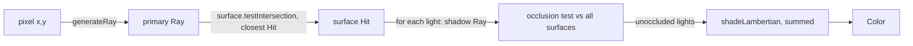

# Part 2 Guide: Shading and Optimization

A step-by-step walkthrough for implementing `src/main/java/cgraytracing/studentwork/Part2.java`.
Assumes Part 1 (`generateRay`, `testAABoxIntersection`, `renderPixelBasic`) is already working —
this part builds directly on top of it.

**How to use this**: same spirit as [PART1_GUIDE.md](PART1_GUIDE.md) — concept, pseudocode, pitfalls,
and a way to verify each function, stopping short of finished code for the core algorithms.

## 0. Setup checklist

- [ ] Set `studentAuthorName` in `Part2.java` to your real name.
- [ ] Switch to **Scene Bank 2** with `Shift+2`; scenes use keys `1`–`9`, `0`, `-` (11 scenes).
- [ ] Renderer key: `v` for Shaded (yours); `z` for Processing (reference).
- [ ] Run `Part2Test` from the IDE's test runner anytime.
- [ ] You can call your Part 1 code directly, e.g. `Part1.generateRay(...)`.

## 1. The data flow



Three new kinds of surfaces can appear in `scene.getSurfaces()` once Part 2 is wired up:
`Triangle`, `SurfaceInstance` (a transformed copy of another surface), and `BVHNode` (an
acceleration structure). All of them reach your code the same way `AABox` did in Part 1 — through
`surface.testIntersection(ray)` polymorphism — so `renderPixelShaded`'s intersection loop doesn't
need to know or care which kind of surface it's looking at.

## 2. API cheat sheet

| Class | Relevant members |
|---|---|
| `Triangle` | `getV1()/getV2()/getV3()` (copies) |
| `SurfaceInstance` | `getSurface()` (underlying), `getTransform()`, `getTransformInv()` (both `PMatrix3D` copies) |
| `BVHNode` | `new BVHNode(left, right, boundingBox)`, `getLeftNode()/getRightNode()`, `getBoundingBox()` |
| `Light` | `getPosition()`, `getColor()` — a point light |
| `Scene` | adds `getLights()` (`ArrayList<Light>`) on top of Part 1's members |
| `Material` | adds `getSpecularColor()`, `getReflectance()`, `getGlossRadius()`, `getSpecPow()` (unused until Part 3) |
| `Color` | `add`, `mult`, `blend(color, alpha)` = `alpha*this + (1-alpha)*color`, `average(ArrayList<Color>)` |
| `MathHelper` | `nanMin`/`nanMax` (from Part 1) |

## 3. `testTriangleIntersection`

**Goal**: ray/triangle intersection, called through `Triangle.testIntersection(ray)`.

**Concept**: use the algorithm from lecture or *Fundamentals of Computer Graphics* 5th ed.
(Cramer's-rule / barycentric solve of the ray-plane-triangle linear system is the standard
approach). Solve for $(t, \beta, \gamma)$ such that the ray hits the plane at barycentric
coordinates $(\alpha, \beta, \gamma) = (1-\beta-\gamma, \beta, \gamma)$; the hit is inside the
triangle only if $\beta \ge 0$, $\gamma \ge 0$, and $\beta + \gamma \le 1$.

Because scene files don't guarantee winding order, you can't rely on a fixed
`cross(v2-v1, v3-v1)` normal direction — the PDF requires the normal to always face the ray
(flip it if it points into the same hemisphere as the ray direction, so a triangle looks correctly
lit from either side).

**Pseudocode**:

```
function testTriangleIntersection(ray, triangle):
    e1 = v2 - v1
    e2 = v3 - v1
    faceNormal = normalize(cross(e1, e2))   # arbitrary winding — direction is ambiguous for now

    solve the ray/triangle linear system for (t, beta, gamma)   # Cramer's rule / your textbook's method
    if no solution, t < 0, beta < 0, gamma < 0, or beta + gamma > 1:
        return new Hit()                     # miss

    if dot(faceNormal, ray.direction) > 0:
        faceNormal = -faceNormal              # flip so it always opposes the incoming ray

    return new Hit(ray, triangle, t, faceNormal)
```

**Where students usually go wrong**:
- Forgetting to flip the normal based on the ray's hemisphere — this matters as soon as shading is
  involved, since a normal facing away from every light makes a correctly-hit triangle render black.
- Off-by-one on the barycentric bounds (`beta + gamma <= 1`, not `< 1` or unconstrained).
- Returning a negative `t` for triangles behind the camera.

**Verify**: run `testTriangleIntersection_basic` (expects `t = 1.0`, normal anti-parallel to
`(0,0,1)`). Visually: `part2-1` (three triangles at different distances — checks closest-hit
selection) and `part2-3` (icosahedron, many triangles) in the Shaded renderer.

## 4. `createTriangleBoundingBox`

**Goal**: the tightest `AABox` that contains all three vertices. Called automatically from
`Triangle`'s constructor — never call it yourself.

**Pseudocode**:

```
function createTriangleBoundingBox(triangle):
    min = componentwise min(v1, v2, v3)
    max = componentwise max(v1, v2, v3)
    return new AABox(min, max)
```

**Where students usually go wrong**: a triangle that's flat along one axis (e.g. all vertices at
the same `z`) has `min.z == max.z`, which is fine — `AABox` and your Part 1 slab test both handle a
zero-thickness box correctly as long as you didn't special-case that away.

**Verify**: run `createTriangleBoundingBox_basic` (expects exact min/max matching the vertices).

## 5. `testSurfaceInstanceIntersection`

**Goal**: let one underlying `Surface` be placed/rotated/scaled many times cheaply, by testing
intersection in the underlying surface's own *local* coordinate space.

**Concept**: `surfaceInstance.getTransform()` is the local→world matrix; `getTransformInv()` is its
inverse (world→local). To find where the *world-space* ray hits the surface:
1. Transform the ray into local space using `transformInv`, then test intersection with
   `underlying` there.
2. If it hit, transform the result back: keep the **original world ray** and the **local `t`**
   (unchanged — translation/rotation/uniform scale don't affect the ray-parameter distance ratio
   here), but the **normal must be transformed back to world space**.

**Hint (points vs. vectors)**: `PMatrix3D.mult(vector, target)` always applies the translation
column, because it treats every `PVector` as a point. For the ray *direction* (and the normal),
you need to ignore translation — apply only the 3×3 linear part. A simple way: copy the matrix,
zero out its translation column (`m03`/`m13`/`m23`), then `mult` the vector through that copy.

**Hint (normal transform)**: a normal is **not** transformed by the same matrix as points/directions
when the transform includes non-uniform scale or rotation — it needs the transpose of the inverse
of the linear part (here, that's the transpose of `transformInv`'s linear part). This is a standard
result from the lecture/textbook on transforming surfaces; for a pure translation or rotation it
happens to equal the direct transform, but the general rule is the transpose-inverse.

**Pseudocode**:

```
function testSurfaceInstanceIntersection(ray, surfaceInstance):
    transformInv = surfaceInstance.getTransformInv()

    localOrigin = transformInv * ray.origin                        # as a point (translation included)
    localDirection = linearPartOf(transformInv) * ray.direction    # as a vector (translation ignored)
    localRay = new Ray(localOrigin, localDirection, ray.time)

    localHit = surfaceInstance.getSurface().testIntersection(localRay)
    if not localHit.didHit():
        return new Hit()

    worldNormal = normalize(transpose(linearPartOf(transformInv)) * localHit.normal)
    return new Hit(ray, localHit.getHitSurface(), localHit.getT(), worldNormal)
```

**Where students usually go wrong**:
- Returning `surfaceInstance` (or `underlying`) as the hit surface instead of
  `localHit.getHitSurface()` — the PDF calls this out explicitly, since it breaks when `underlying`
  is itself a `BVHNode` (a `BVHNode` isn't the thing you want rendered/shaded).
- Passing `ray` (world-space) instead of `localRay` into `underlying.testIntersection`.
- Reusing `ray`'s time value incorrectly — pass `ray.getTime()` through unchanged into the local ray.

**Verify**: run `testSurfaceInstanceIntersection_basic` (a pure-translation transform; hit surface,
`t`, and normal should all match the untransformed values). Visually: `part2-4` (one named triangle
instanced 3× with `translate`/`scale`/`rotate`) and especially `part2-5` (named boxes instanced at
non-axis-aligned rotations — this one will look subtly wrong, with lighting in the wrong place,
if the normal transform isn't handled correctly). Also `part2-10` (bunny instanced 7×).

## 6. `createBVH`

**Goal**: build a bounding volume hierarchy from a flat list of surfaces, to avoid testing every
ray against every surface.

**Concept** (top-down, recursive — from the PDF):
1. Base case: if the list has 1 surface, return it directly.
2. Compute an `AABox` that circumscribes every surface's bounding box in the list (component-wise
   min of mins, max of maxes).
3. Split the list into two non-empty sublists by some criterion (e.g. sort by bounding-box centroid
   along the box's longest axis, then split the sorted list in half).
4. Return `new BVHNode(createBVH(left), createBVH(right), boundingBox)`.

**Pseudocode**:

```
function createBVH(surfaces):
    if surfaces.size() == 1:
        return surfaces[0]

    boundingBox = union of surfaces[i].getBoundingBox() for all i

    axis = longest axis of boundingBox
    sort surfaces by their bounding box's center along axis
    left, right = split sorted surfaces list in half

    return new BVHNode(createBVH(left), createBVH(right), boundingBox)
```

**Where students usually go wrong**:
- Splitting into an empty list + full list (degenerate tree, no real speedup, and against the
  "ensure the tree is not degenerate" requirement).
- Forgetting `AABox` instances are their own bounding box (`aaBox.getBoundingBox() == aaBox`), so
  the union logic doesn't need a special case for them.
- Calling `Part2.createBVH` from anywhere except inside itself — it's invoked once at scene load,
  not per-pixel.

**Verify**: run `createBVH_basic` (2 surfaces → root is a `BVHNode` whose bounding box is the union
of both). Visually: `part2-6` (ten small triangles, all wrapped in `begin_accel`/`end_accel`) is
the simplest case to sanity check once `testBVHNodeIntersection` (next section) is also implemented.

## 7. `testBVHNodeIntersection`

**Goal**: traverse the tree, only descending into subtrees whose bounding box the ray actually hits.

**Pseudocode**:

```
function testBVHNodeIntersection(ray, bvhNode):
    if not bvhNode.getBoundingBox().testIntersection(ray).didHit():
        return new Hit()                     # ray misses this node's whole subtree

    leftHit = bvhNode.getLeftNode().testIntersection(ray)
    rightHit = bvhNode.getRightNode().testIntersection(ray)

    return whichever of leftHit / rightHit has the smaller t
```

**Where students usually go wrong**:
- Calling `Part2.testBVHNodeIntersection(ray, bvhNode.getLeftNode())` directly instead of
  `bvhNode.getLeftNode().testIntersection(ray)` — the PDF flags this explicitly, since a leaf child
  is a `Triangle`/`AABox`/`Sphere`, not a `BVHNode`, and only polymorphic dispatch through
  `testIntersection` handles both cases.
- Testing the bounding box *after* recursing into children instead of before — defeats the purpose
  of the acceleration structure.
- Rebuilding a new `Hit` instead of just returning whichever child `Hit` already has the smaller
  `t` — both children's `Hit` objects already reference the correct ray/surface/normal, so there's
  nothing to reconstruct here.

**Verify**: run `testBVHNodeIntersection_basic` (front child wins over back child; bounding-box hit
doesn't short-circuit the result). Visually/perf: `part2-7` (500-vertex bunny, **no** acceleration —
scene comment literally says "slow to render") vs. `part2-8` (same bunny, **with** acceleration —
"fast to render") should produce the identical image with a dramatically different `renderTime` in
the debug text. `part2-9` (69k-vertex bunny) and `part2-11` (GT logo) are only tractable at all with
a working BVH; `part2-10` combines BVH leaves with 7 `SurfaceInstance` copies.

## 8. `shadeLambertian`

**Goal**: the Lambertian (diffuse) reflectance term for one light.

**Concept**: $L_o = k_d \cdot L_i \cdot \max(0, N \cdot L)$, where $k_d$ is the surface diffuse
color, $L_i$ is the light color, $N$ the surface normal, and $L$ the **normalized** direction to
the light. No ambient term.

**Pseudocode**:

```
function shadeLambertian(normal, lightDirection, surfaceDiffuseColor, lightColor):
    l = normalize(lightDirection)
    intensity = max(0, dot(normal, l))
    return surfaceDiffuseColor * lightColor * intensity   # Color.mult, componentwise
```

**Where students usually go wrong**: forgetting to normalize `lightDirection` (it arrives as a
raw `surface → light` vector, not unit length), or clamping with `abs()` instead of `max(0, ...)`
(back-facing lights should contribute nothing, not a mirrored negative-flipped amount).

**Verify**: run `shadeLambertian_basic` (normal and light direction aligned, white light → output
equals the surface's diffuse color exactly).

## 9. `renderPixelShaded`

**Goal**: extend `renderPixelBasic` with shadows + Lambertian shading.

**Pseudocode**:

```
function renderPixelShaded(scene, outputWidth, outputHeight, x, y):
    ray = Part1.generateRay(scene.camera, outputWidth, outputHeight, x, y)
    hit = closest intersection of ray against scene.surfaces         # same loop as Part 1
    if not hit.didHit():
        return scene.backgroundColor

    outputColor = Color(0, 0, 0)
    for light in scene.lights:
        toLight = light.getPosition() - hit.getHitLocation()
        shadowRay = new Ray(hit.getHitLocation(), toLight)           # nudge origin off the surface

        occluded = false
        for surface in scene.surfaces:
            shadowHit = surface.testIntersection(shadowRay)
            if shadowHit.didHit() and shadowHit.getT() < 1.0:        # closer than the light itself
                occluded = true
                break

        if not occluded:
            outputColor += shadeLambertian(hit.normal, toLight, hit.hitSurface.material.diffuseColor, light.color)

    return outputColor
```

**Where students usually go wrong**:
- **Self-intersection ("shadow acne")**: a shadow ray starting exactly on the surface can
  re-intersect that same surface at `t ≈ 0` due to floating-point error, making everything falsely
  occluded. Nudge the shadow ray's origin slightly along the normal, or ignore hits with a tiny `t`.
- **Occlusion threshold**: since `toLight` (light position minus hit location) is not normalized,
  `t = 1.0` along the shadow ray lands exactly on the light — an occluder must have `t < 1.0` (not
  just `t > 0`) to actually be *between* the surface and the light, per the PDF's note that an
  intersection doesn't automatically mean occlusion.
- Forgetting there's no ambient term — an unlit point should stay black, not some minimum color.

**Verify**: switch to Shaded renderer (`v`) on part2 scenes 1–11 and compare against the PDF's
`Scenes` section — flat shading with correct shadows, no shadow acne, no incorrect self-shadowing.
`part2-2` (a triangle over a ground plane, single light) is the clearest single-shadow check; `part2-3`
(icosahedron lit by 3 colored lights + 1 dim fill light) is the best multi-light color-blend check.

## 10. Full verification pass

- [ ] `Part2Test` — all green in the IDE test runner.
- [ ] Scenes 1–11 (part2 bank), Shaded renderer, match the PDF images.
- [ ] `part2-7` (no BVH) vs `part2-8`+ (BVH) — same picture, dramatically different `renderTime`.
- [ ] Window/render target/screenshot resolution all 1280×720.

## 11. Submission checklist

Files: `Part1.java`, `Part2.java` + these screenshots at 1280×720:

- `part2-1-ShadedRenderer.png` … `part2-11-ShadedRenderer.png`

Each image must show your real name in the green debug text.
