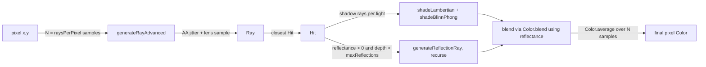

# Part 3 Guide: Distribution Ray Tracing

A step-by-step walkthrough for implementing `src/main/java/cgraytracing/studentwork/Part3.java`.
Assumes Parts 1 and 2 are already working — `renderPixelAdvanced` reuses the intersection,
shadow-ray, and Lambertian-shading logic you already wrote, plus everything here.

**How to use this**: same spirit as [PART1_GUIDE.md](PART1_GUIDE.md) / [PART2_GUIDE.md](PART2_GUIDE.md)
— concept, pseudocode, pitfalls, and a way to verify each function, stopping short of finished code
for the core algorithms.

## 0. Setup checklist

- [ ] Set `studentAuthorName` in `Part3.java` to your real name.
- [ ] Switch to **Scene Bank 3** with `Shift+3`; scenes use keys `1`–`9`, `0`, `-`, `=` (12 scenes).
- [ ] Renderer key: `b` for Advanced (yours).
- [ ] Run `Part3Test` from the IDE's test runner anytime.
- [ ] These scenes are much heavier (`rays_per_pixel` up to 100) — expect noticeably longer render
      times, especially before your BVH from Part 2 is solid.

## 1. The data flow



Two new surfaces can appear in `scene.getSurfaces()`: `Sphere` and `SurfaceMoving` (a surface
translating over time, sampled via `ray.getTime()`). Lights can now include `DiskLight`, an area
light that returns a different random point every time `getPosition()` is called — that's what
produces soft shadows for free once your shadow-ray code from Part 2 calls it once per shadow ray.

## 2. API cheat sheet

| Class | Relevant members |
|---|---|
| `Sphere` | `getPosition()`, `getRadius()` |
| `SurfaceMoving` | `getSurface()` (underlying), `getTranslation()` (not normalized; encodes direction + distance travelled over `time ∈ [0,1]`) |
| `DiskLight` | `getPosition()` — **new random point on the disk every call**; `getPositionAbsolute()` — fixed disk center |
| `Ray` | `getTime()` — random `[0,1)` unless passed explicitly to the 3-arg constructor |
| `Hit` | `getHitLocation()` = `ray.evaluate(t)` |
| `Camera` | `getPositionLens()`, `getFocalDist()`, `getLensRadius()`, `getAntiAlias()` |
| `Scene` | `getRaysPerPixel()`, `getMaxReflections()` |
| `Material` | `getSpecularColor()`, `getReflectance()` (`[0,1]`, 0=diffuse, 1=mirror), `getGlossRadius()` (fuzz radius, 0=perfect mirror), `getSpecPow()` |
| `Color` | `blend(color, alpha)` = `alpha*this + (1-alpha)*color`; `average(ArrayList<Color>)` |

## 3. `testSphereIntersection`

**Goal**: ray/sphere intersection, called through `Sphere.testIntersection(ray)`.

**Concept**: substitute the ray equation $P(t) = O + tD$ into $|P - C|^2 = r^2$ to get a quadratic
in $t$: $at^2 + bt + c = 0$ with $a = D \cdot D$, $b = 2D \cdot (O - C)$, $c = (O-C)\cdot(O-C) - r^2$.
Two real roots means the ray enters and exits the sphere; pick the smallest **positive** root (if
the smaller root is negative, the ray origin is inside the sphere — use the other root instead of
reporting a miss).

**Pseudocode**:

```
function testSphereIntersection(ray, sphere):
    oc = ray.origin - sphere.position
    a = dot(ray.direction, ray.direction)
    b = 2 * dot(ray.direction, oc)
    c = dot(oc, oc) - sphere.radius^2

    discriminant = b^2 - 4ac
    if discriminant < 0:
        return new Hit()                       # no real roots -> miss

    t = smallest positive root of the quadratic  # check both roots; reject negative ones
    if no positive root:
        return new Hit()

    hitPoint = ray.evaluate(t)
    normal = normalize(hitPoint - sphere.position)   # points outward; Hit's constructor normalizes anyway
    return new Hit(ray, sphere, t, normal)
```

**Where students usually go wrong**:
- Using `2a` in the quadratic formula's denominator but forgetting `a` isn't `1` when
  `ray.direction` isn't normalized (it generally won't be, matching Parts 1–2's convention).
  Numerically it still works out — the `t` value is just relative to that direction's own length,
  which is exactly what `Ray.evaluate(t)` expects — but a shortcut assuming `a = 1` is wrong.
- Not handling the "camera inside the sphere" case (both roots aren't necessarily positive).

**Verify**: run `testSphereIntersection_basic` (ray hits sphere front face at `t=1`, normal
`(0,0,-1)`). Visually: `part3-1` (three glossy spheres) is the simplest sphere-only scene.

## 4. `createSphereBoundingBox`

**Goal**: axis-aligned box around a sphere. Called automatically from `Sphere`'s constructor.

**Pseudocode**:

```
function createSphereBoundingBox(sphere):
    r = vector(sphere.radius, sphere.radius, sphere.radius)
    return new AABox(sphere.position - r, sphere.position + r)
```

**Verify**: run `createSphereBoundingBox_basic` (sphere at origin, radius 1 → box `(-1,-1,-1)` to
`(1,1,1)`).

## 5. `getRandomPositionOnDisk`

**Goal**: a uniformly-random point on a disk in 3D, given its center, radius, and two orthogonal
in-plane basis vectors (`direction1`, `direction2`). Used both for the camera's lens (depth of
field) and `DiskLight` (soft shadows) — you write it once, both features get it for free.

**Concept**: sample uniformly in a 2D disk of the given radius (e.g. rejection sampling: pick
`(u, v)` uniformly in `[-radius, radius]²`, reject and resample if `u² + v² > radius²`), then map
the accepted 2D point into 3D as `diskCenter + u*direction1 + v*direction2`. The PDF calls out one
edge case explicitly: **if `radius` is `0`, always return `diskCenter` exactly** (no sampling loop
needed/possible).

**Pseudocode**:

```
function getRandomPositionOnDisk(diskCenter, radius, direction1, direction2):
    if radius == 0:
        return diskCenter

    loop:
        u = random in [-radius, radius]
        v = random in [-radius, radius]
        if u^2 + v^2 <= radius^2:
            return diskCenter + u*direction1 + v*direction2
```

**Where students usually go wrong**: sampling `u, v` in `[0, radius]` instead of
`[-radius, radius]` (biases every sample into one quadrant), or forgetting the `radius == 0` special
case (a rejection loop with `radius = 0` only ever succeeds when `u == v == 0`, which is not
guaranteed to terminate quickly with floating-point randoms).

**Verify**: run `getRandomPositionOnDisk_basic` (`radius = 0` → returns `diskCenter` exactly).
Visually, this function is exercised indirectly by every DOF/soft-shadow scene (`part3-4` through
`part3-6`, `part3-8`, `part3-11`) — no direct one-to-one image, since its output is random by design.

## 6. `testSurfaceMovingIntersection`

**Goal**: intersect a ray with a surface that linearly translates over time, called through
`SurfaceMoving.testIntersection(ray)`.

**Concept**: at `ray.getTime() == 0` the surface is at its rest position; at `time == 1` it has
moved by the full `translation` vector. Rather than moving the surface, move the ray into the
surface's rest frame: subtract `translation * ray.getTime()` from the ray's origin, test
intersection with `underlying` there, and pass the *original* ray/time/hit-surface back out
unchanged (pure translation doesn't affect direction or normal, unlike `SurfaceInstance`'s general
transform in Part 2).

**Pseudocode**:

```
function testSurfaceMovingIntersection(ray, surfaceMoving):
    offset = surfaceMoving.getTranslation() * ray.getTime()
    localRay = new Ray(ray.origin - offset, ray.direction, ray.time)

    localHit = surfaceMoving.getSurface().testIntersection(localRay)
    if not localHit.didHit():
        return new Hit()

    return new Hit(ray, localHit.getHitSurface(), localHit.getT(), localHit.getNormal())
```

**Where students usually go wrong**: forgetting to scale `translation` by `ray.getTime()` (moving
the ray by the *full* translation regardless of time collapses motion blur into a single fixed
offset, i.e. no blur at all). Also, direction should **not** be touched — only the origin shifts
for a pure translation.

**Verify**: run `testSurfaceMovingIntersection_basic` (`time = 1.0`, full translation applied).
Visually: `part3-3` (motion-blurred spheres/triangles) and `part3-11` (combined soft effects) —
moving objects should show directional streaking, not a ghosted double-image or no blur at all.

## 7. `shadeBlinnPhong`

**Goal**: the specular highlight term for one light.

**Concept**: $L_o = k_s \cdot L_i \cdot \max(0, N \cdot H)^{n}$, where $k_s$ is the surface specular
color, $H = \text{normalize}(L + V)$ is the half-vector between the (normalized) light direction
$L$ and (normalized) view direction $V$, and $n$ is the Phong exponent (`specPow`).

**Pseudocode**:

```
function shadeBlinnPhong(normal, lightDirection, viewDirection, surfaceSpecularColor, lightColor, specPow):
    l = normalize(lightDirection)
    v = normalize(viewDirection)
    h = normalize(l + v)
    intensity = max(0, dot(normal, h)) ^ specPow
    return surfaceSpecularColor * lightColor * intensity
```

**Where students usually go wrong**: forgetting to normalize `lightDirection`/`viewDirection`
before building the half-vector, or using `dot(normal, lightDirection)` (that's Lambertian, not
specular) instead of `dot(normal, halfVector)`.

**Verify**: run `shadeBlinnPhong_basic` (light and view mirrored about the normal → half-vector
exactly aligned with normal → output equals the surface's specular color exactly). Visually:
`part3-1` (three spheres with different `specPow` values — tighter highlight as the exponent grows).

## 8. `generateRayAdvanced`

**Goal**: extend Part 1's `generateRay` with two independent features: anti-aliasing (jittered
sample position within the pixel) and depth of field (ray origin sampled over a lens disk, with
all samples for one pixel converging on the same point on a focal plane).

**Concept — anti-aliasing**: Part 1's `generateRay` always sampled the exact center of the pixel.
When `camera.getAntiAlias()` is true, jitter the sample point randomly within the pixel's footprint
before computing the ray direction, instead of always using the center. Averaging many such rays
per pixel (`renderPixelAdvanced`, next section) is what smooths jagged edges.

**Concept — depth of field**: reuse the *pinhole* direction you'd compute from
`camera.getPosition()` (i.e. exactly Part 1's `generateRay` logic, jittered or not) to find where
this pixel's ray would cross the **focal plane**: `focalPoint = camera.getPosition() +
pinholeDirection * camera.getFocalDist()`. Then set the actual ray's origin to a random point on
the lens disk (`camera.getPositionLens()`), and its direction to `focalPoint - lensOrigin`. Every
lens sample for the same pixel aims at the same `focalPoint`, so objects exactly at the focal
distance stay sharp while everything else blurs — the amount of blur is controlled by
`camera.getLensRadius()` (0 = pinhole camera, no blur).

**Pseudocode**:

```
function generateRayAdvanced(camera, outputWidth, outputHeight, x, y):
    (jitterX, jitterY) = (0.5, 0.5)                        # Part 1's fixed pixel-center sample
    if camera.getAntiAlias():
        (jitterX, jitterY) = random offset, each in [0, 1)  # jittered sample within the pixel

    pinholeDirection = same screen-space direction formula as Part1.generateRay,
                       but using (x + jitterX, y + jitterY) instead of always (x + 0.5, y + 0.5)

    focalPoint = camera.getPosition() + pinholeDirection * camera.getFocalDist()

    origin = camera.getPositionLens()
    direction = focalPoint - origin

    return new Ray(origin, direction)
```

**Where students usually go wrong**:
- Computing `focalPoint` from `camera.getPositionLens()` instead of `camera.getPosition()` — the
  focal point must be anchored to the camera's optical axis, not wherever a particular lens sample
  landed, otherwise every sample converges on a *different* point and depth of field doesn't work.
- Applying the pixel jitter only when generating the direction but forgetting it also has to feed
  into the *same* `(jitterX, jitterY)` used for the focal point calculation (they must be the same ray).
- Not reusing your Part 1 direction formula exactly — any drift between the two breaks focus at
  `lensRadius = 0`, which is exactly what `generateRayAdvanced_basic` checks (with anti-aliasing
  off, this must reduce to a very specific direction).

**Verify**: run `generateRayAdvanced_basic` (anti-aliasing off, checks the exact ray origin and
direction against a hand-computed lens/focal-plane geometry). Visually: `part3-5` (near focus) and
`part3-6` (far focus, same rows of spheres) — the row of spheres at the focal distance should be
sharp, with increasing blur further away in either direction. `part3-2` (anti-aliased edges) is the
clearest AA-only check (no lens blur) — silhouette edges should look smooth, not jagged, once
`renderPixelAdvanced` averages enough samples.

## 9. `generateReflectionRay`

**Goal**: mirror-reflect an incident ray off a hit surface, called from `renderPixelAdvanced` for
surfaces with `reflectance > 0`.

**Concept**: standard mirror reflection: $R = D - 2(D \cdot N)N$, where $D$ is the incident ray's
direction and $N$ the (already-normalized) surface normal at the hit. The reflected ray originates
at the **hit location** (not the incident ray's origin), and must carry the incident ray's `time`
forward unchanged (so a reflection off a moving/motion-blurred object stays consistent). If
`material.getGlossRadius() > 0`, perturb the reflected direction randomly within a small radius
around the perfect mirror direction to get a fuzzy/glossy reflection instead of a sharp one — do
**not** reject/resample perturbed rays that end up pointing into the surface; the PDF explicitly
says to let them through as-is.

**Pseudocode**:

```
function generateReflectionRay(hit):
    incoming = hit.getRay()
    d = incoming.getDirection()
    n = hit.getNormal()

    reflected = d - 2 * dot(d, n) * n

    glossRadius = hit.getHitSurface().getMaterial().getGlossRadius()
    if glossRadius > 0:
        reflected += small random perturbation, magnitude scaled by glossRadius

    origin = hit.getHitLocation()
    return new Ray(origin, reflected, incoming.getTime())
```

**Where students usually go wrong**:
- Using `hit.getRay().getOrigin()` as the new ray's origin instead of `hit.getHitLocation()` —
  the reflection has to start where the surface was actually hit, not back at the camera/previous
  bounce.
- Constructing the returned `Ray` with the 2-arg constructor (`new Ray(origin, reflected)`),
  which assigns a fresh random time instead of propagating `incoming.getTime()` — breaks motion
  blur through reflections and fails `generateReflectionRay_basic`'s time-equality check.
- Self-intersection: the reflection ray can immediately re-hit the same surface at `t ≈ 0` due to
  floating-point error — same fix as Part 2's shadow rays (nudge the origin, or ignore
  near-zero-`t` hits when tracing this ray further).

**Verify**: run `generateReflectionRay_basic` (45° incident ray off a horizontal normal reflects
to the mirrored 45° direction; `getTime()` preserved exactly). Visually: `part3-7` (several mirror
spheres/rectangle), `part3-9` (four spheres with different `glossRadius` values — compare sharp vs.
increasingly fuzzy reflections), `part3-12` (sphere inside a mirrored rhombicuboctahedron,
`max_reflections 15` — a good stress test for reflection recursion depth).

## 10. `renderPixelAdvanced`

**Goal**: tie everything in Parts 1–3 together: multiple samples per pixel, direct lighting
(Lambertian + Blinn-Phong + shadows), and recursive reflections.

**Concept**: for each of `scene.getRaysPerPixel()` samples, generate a ray with
`generateRayAdvanced`, then trace it recursively:
- On a miss, contribute `scene.getBackgroundColor()`.
- On a hit, compute direct lighting exactly like Part 2's `renderPixelShaded`, except using
  *both* `shadeLambertian` (diffuse) and `shadeBlinnPhong` (specular) per unoccluded light, summed
  together.
- If `material.getReflectance() > 0` and the recursion depth hasn't reached
  `scene.getMaxReflections()`, trace a `generateReflectionRay` recursively and blend it with the
  direct-lighting color using `Color.blend(reflectedColor, 1 - reflectance)` (i.e. `reflectance`
  weights how much of the reflected color shows through versus the surface's own shaded color).
- Average the `raysPerPixel` sample colors together (`Color.average`).

**Pseudocode**:

```
function renderPixelAdvanced(scene, outputWidth, outputHeight, x, y):
    samples = []
    repeat scene.getRaysPerPixel() times:
        ray = generateRayAdvanced(scene.camera, outputWidth, outputHeight, x, y)
        samples.add(traceRay(scene, ray, depth = 0))
    return Color.average(samples)

function traceRay(scene, ray, depth):
    hit = closest intersection of ray against scene.surfaces
    if not hit.didHit():
        return scene.backgroundColor

    material = hit.hitSurface.material
    viewDirection = -ray.direction

    directColor = Color(0, 0, 0)
    for light in scene.lights:
        toLight = light.getPosition() - hit.getHitLocation()     # DiskLight: new random point each call
        shadowRay = new Ray(hit.getHitLocation(), toLight)        # nudge origin to avoid self-shadowing
        if not occluded(scene, shadowRay):                        # same t < 1.0 occlusion check as Part 2
            directColor += shadeLambertian(hit.normal, toLight, material.diffuseColor, light.color)
            directColor += shadeBlinnPhong(hit.normal, toLight, viewDirection,
                                            material.specularColor, light.color, material.specPow)

    if material.reflectance > 0 and depth < scene.getMaxReflections():
        reflectionRay = generateReflectionRay(hit)
        reflectedColor = traceRay(scene, reflectionRay, depth + 1)
        return reflectedColor.blend(directColor, material.reflectance)
    else:
        return directColor
```

**Where students usually go wrong**:
- **Recursion base case**: forgetting to stop at `scene.getMaxReflections()` causes infinite
  recursion between facing mirrors (see `part3-12`, which specifically raises `max_reflections` to
  stress-test this).
- **Blend direction**: `Color.blend(color1, color2, alpha)` returns `alpha*color1 + (1-alpha)*color2`
  — double check which argument gets `reflectance` vs. `1 - reflectance` so a `reflectance = 1`
  surface is a pure mirror and `reflectance = 0` is pure direct lighting.
- **`DiskLight.getPosition()`** returns a fresh random point every call — call it exactly once per
  shadow ray (store it in a local variable) rather than calling it multiple times inline, which
  would silently compare against inconsistent points.
- Re-running the full `raysPerPixel` loop *inside* `traceRay`'s recursive reflection call (only the
  outermost call in `renderPixelAdvanced` should loop over samples — reflection recursion is a
  single ray per bounce, not a nested Monte-Carlo loop).

**Verify**: switch to Advanced renderer (`b`) on part3 scenes 1–12 and compare against the PDF's
`Scenes` section:
- `part3-1`: specular highlights sharpen with higher `specPow`.
- `part3-2`: anti-aliased silhouette edges, no jaggies.
- `part3-3`, `part3-11`: motion-blur streaks.
- `part3-4`, `part3-8`, `part3-11`: soft-edged disk-light shadows (not hard-edged).
- `part3-5`, `part3-6`: depth-of-field blur increasing away from the focal plane.
- `part3-7`, `part3-9`, `part3-10`, `part3-12`: reflections, from sharp mirrors to increasingly
  fuzzy (`glossRadius`), without infinite recursion or blown-out/black surfaces.

## 11. Full verification pass

- [ ] `Part3Test` — all green in the IDE test runner.
- [ ] Scenes 1–12 (part3 bank), Advanced renderer, match the PDF images.
- [ ] No infinite recursion / stack overflow on `part3-12` (`max_reflections 15`).
- [ ] Window/render target/screenshot resolution all 1280×720.

## 12. Submission checklist

Files: `Part1.java`, `Part2.java`, `Part3.java` + these screenshots at 1280×720:

- `part3-1-AdvancedRenderer.png` … `part3-12-AdvancedRenderer.png`

Each image must show your real name in the green debug text.
