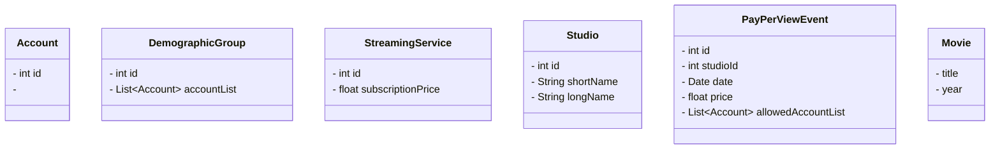

```mermaid
classDiagram
	class Account{
		- int id
		- 
	}
	class DemographicGroup{
		- int id
		- List~Account~ accountList
	}
	class StreamingService{
		- int id
		- float subscriptionPrice
	}
	class Studio{
		- int id
		- String shortName
		- String longName
	}
	class PayPerViewEvent{
		- int id
		- int studioId
		- Date date
		- float price
		- List~Account~ allowedAccountList
	}
	class Movie{
		- title
		- year
	}
	
```
