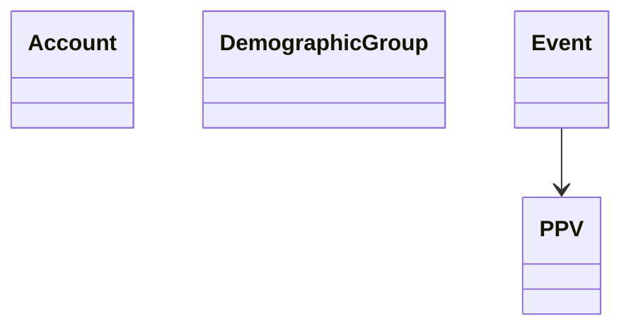

# Exam Problem Notes
## Summary
- **The Streaming Wars** project focuses on interaction between demographic groups (consumers) and streaming services.
- The application allows users to:
	- Create different groups of consumers, services and related concepts
	- Update details about the groups and services
	- Allow interactions between customers and services as needed
	- Display reports about how the services have been used, how costs have been incurred, etc.
## Requirement Notes
**Potential Classes**:
- Profile
	- age
	- name
	- other descriptive stuff
- Account
	- List subscribed services?
	- Set of Profile
	- An account can represent one or more people as a family (think Netflix)
	- viewEvent(Movie m)
	- addDemographicGroup()
	- removeDemographicGroup()
- Demographic Group
	- Contains 0 or more accounts (List of accounts)
		- No rules on names or relations
	- Have a short name and a long name (description)
	- Has a number of accounts in the group that can vary over time
	- 'Spend money representative of the shows that its members have watched so far, which varies over time' (total spent?)
	- Might need a singleton list of demographic groups
	- Users can create and update the number of accounts in a demographic group as needed (I assume this means for themselves?)
- Movies / PPV Events
	- boolean isPPV can determine if the event is Pay Per View or not
	- Movies have:
		- name
		- duration
		- year it was produced
		- (publisherId / studioId)?
		- Assume that movies produced in a given year will always be unique
		- List of genres (1 or more)
		- **USER SHOULD BE ABLE TO CREATE NEW GENRES AS NEEDED**
		- Each movie can be offered by multiple streaming services
	- PPVs have a price that is set **per streaming service**
		- Date offered
- StreamingService
	- List of movies/ppvs that they offer
	- Has a short name and a long name (description)
	- MonthlySubscriptionPrice
		- Viewers can watch as many movies as they want if they are subscribed
		- Set the price on PPV events. Users do not need to be subscribed to watch it. 
	- getCurrentEvents()
	- USERS MUST PICK WHICH STREAMING SERVICE THEY ARE WATCHING ON
- Genre
	- short name
	- description
- Studio/PublishingGroup
	- Movies and PPVs must be developed and produced by studios/publishingGroups
	- Studios create movies and PPVs, and license them to streaming services
	- Has a short name and a long name
	- Sets a base price to license movies / PPVs
	- A  movie / PPV can only be offered by one studio (studioId in movie class?)
- ViewerTransaction?
	- accountId
	- movie/ppvId
	- studioId
	- date
	- cost
	- List DemographicGroupIds
	- Viewers must pay for PPV events even if they are subscribed
- LicenseTransaction
	- StudioId
	- StreamingServiceId
	- date
	- cost
- TransactionHistory (Singleton)
	- List ViewerTransactions
	- List LicenseTransactions
- Admin / Business User?
	- Can create and update demographic groups
	- Can create genres
**Other Requirements**
- Transaction

