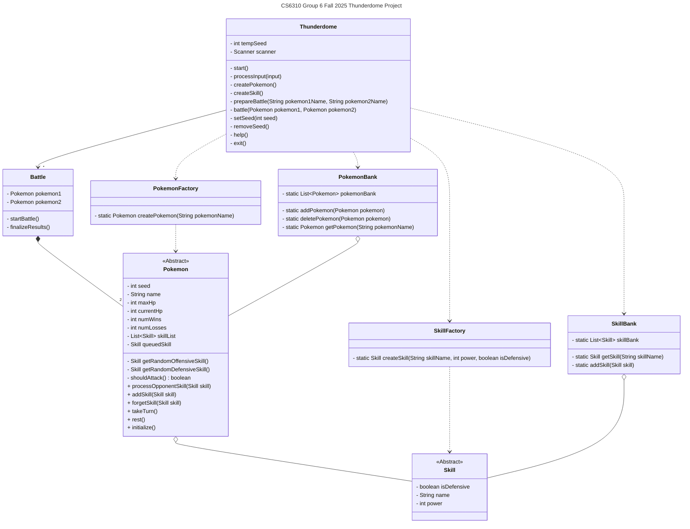

```mermaid
---
title: CS6310 Group 6 Fall 2025 Thunderdome Project
---
classDiagram

    class Thunderdome
    class Battle
    class Pokemon
    class Skill
    class PokemonFactory
    class SkillFactory
    class PokemonBank
    class SkillBank

    Thunderdome --> "*" Battle 
    Battle *-- "2" Pokemon 
    Pokemon o-- Skill

    Thunderdome ..> PokemonFactory
    Thunderdome ..> SkillFactory 
    Thunderdome ..> PokemonBank 
    Thunderdome ..> SkillBank
     
    PokemonFactory ..> Pokemon 
    SkillFactory ..> Skill 

    PokemonBank o-- Pokemon
    SkillBank o-- Skill

    class Skill {
        <<Abstract>>
        - boolean isDefensive
        - String name
        - int power
    }

    class Pokemon {
        <<Abstract>>
        - int seed
        - String name
        - int maxHp
        - int currentHp
        - int numWins
        - int numLosses
        - List~Skill~ skillList
        - Skill queuedSkill
        - Skill getRandomOffensiveSkill()
        - Skill getRandomDefensiveSkill()
        - shouldAttack() boolean
        + processOpponentSkill(Skill skill)
        + addSkill(Skill skill)
        + forgetSkill(Skill skill)
        + takeTurn()
        + rest()
        + initialize()
    }

    class PokemonBank {
        - static List~Pokemon~ pokemonBank
        - static addPokemon(Pokemon pokemon)
        - static deletePokemon(Pokemon pokemon)
        - static Pokemon getPokemon(String pokemonName)
    }

    class SkillBank {
        - static List~Skill~ skillBank
        - static Skill getSkill(String skillName)
        - static addSkill(Skill skill)
    }

    class PokemonFactory {
        - static Pokemon createPokemon(String pokemonName)
    }

    class SkillFactory {
        - static Skill createSkill(String skillName, int power, boolean isDefensive)
    }

    class Thunderdome {
        - int tempSeed
        - Scanner scanner
        - start()
        - processInput(input)
        - createPokemon()
        - createSkill()
        - prepareBattle(String pokemon1Name, String pokemon2Name)
        - battle(Pokemon pokemon1, Pokemon pokemon2)
        - setSeed(int seed)
        - removeSeed()
        - help()
        - exit()
    }

    class Battle {
        - Pokemon pokemon1
        - Pokemon pokemon2
        - startBattle()
        - finalizeResults()
    }


```

