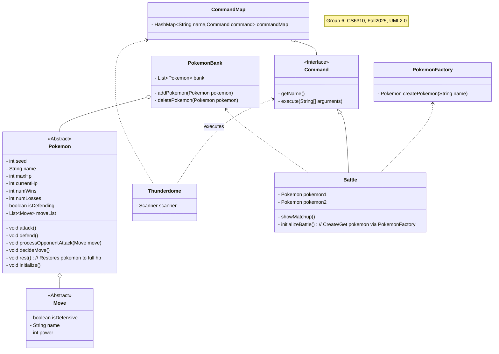

- Battle Command is a Command (make relationship)
- Pokemon have a list of moves (aggregation?)
- Include command map?

- Before the battle starts
	- Create the two pokemon IF they don't exist in the storage
		- If they do exist, send the existing pokemon to the thunderdome
	- Move those two pokemon instances into a list or some sort of storage
		- (Not in thunderdome, storage class?)
	- Send those two to the thunderdome

- Thunderdome gets/uses/executes commands
- Connects the commands to the pokemon

Thunderdome accepts user input?
Can battles exist without 2 pokemon
 