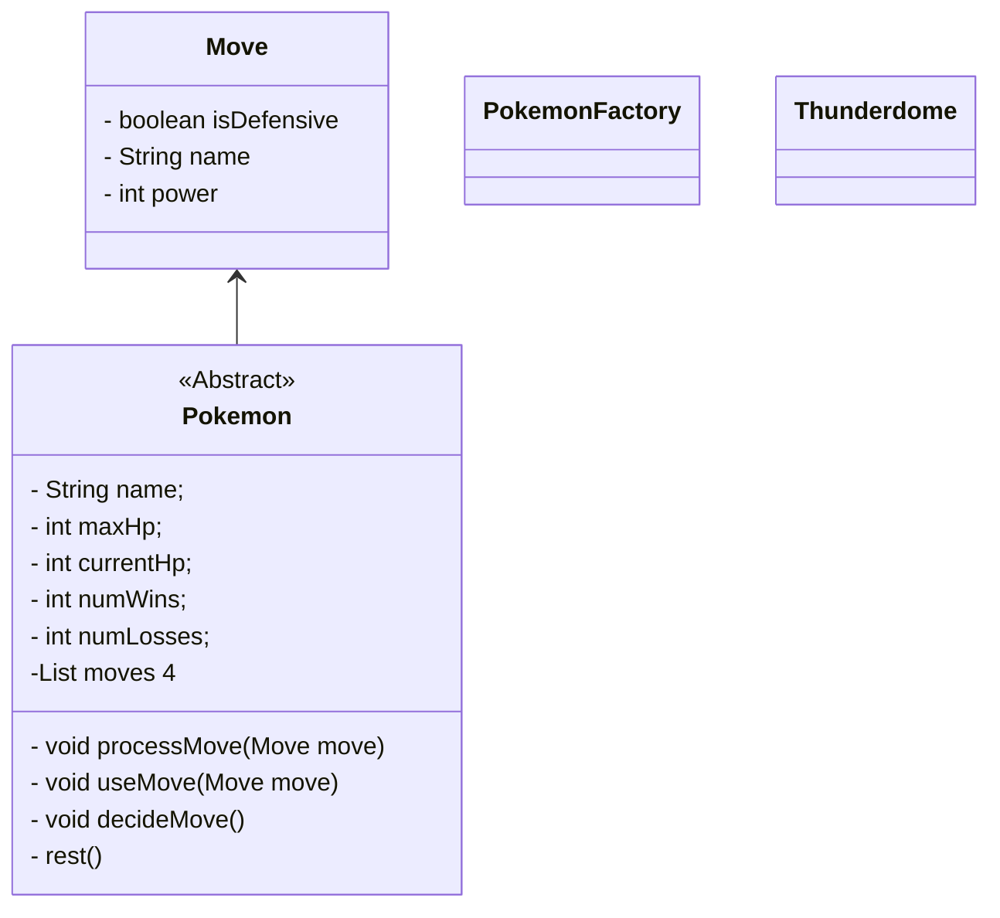

```mermaid
classDiagram
	Move <-- Pokemon
	class PokemonFactory{
	}
	
	class Move{
		- boolean isDefensive
		- String name
		- int power
	}
	
	class Pokemon{
		<<Abstract>>
		- String name;
		- int maxHp;
		- int currentHp;
		- int numWins;
		- int numLosses;
		-List<Move>	moves 4
		- void processMove(Move move)
		- void useMove(Move move) 
		- void decideMove()
		- rest()
	}
	
	class Thunderdome{
	}
	

```
Figure out how to make 