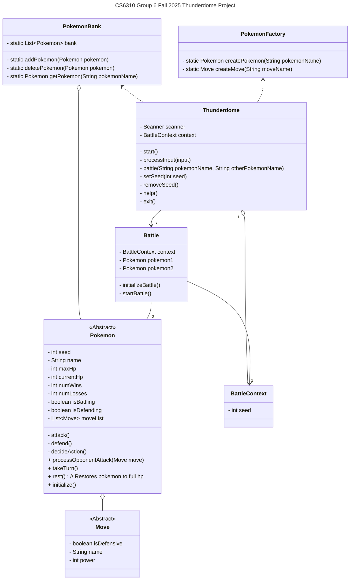

- Does PokemonFactory need a relationship to Pokemon?
	- Add comment about reflection implementation
- Pokemon affects Pokemon relationship?
- Automatically add pokemon to the bank after it's been created (relationship between bank and factory)

- Thunderdome has one battlecontext
- Thunderdome can create any amount of battles
- Each battle has 2 pokemon
- 
