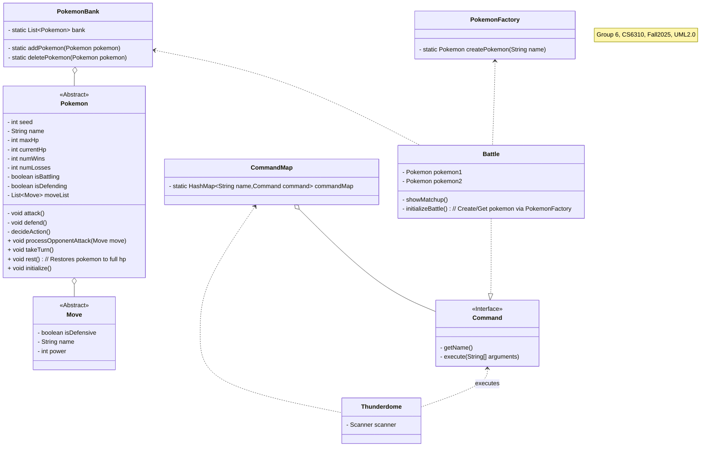

- Does PokemonFactory need a relationship to Pokemon?
	- Add comment about reflection implementation
- Pokemon affects Pokemon relationship?
- Automatically add pokemon to the bank after it's been created (relationship between bank and factory)
- Where/when does seed get set?
	- Battle class in thunderdome, setseed method for battle
 