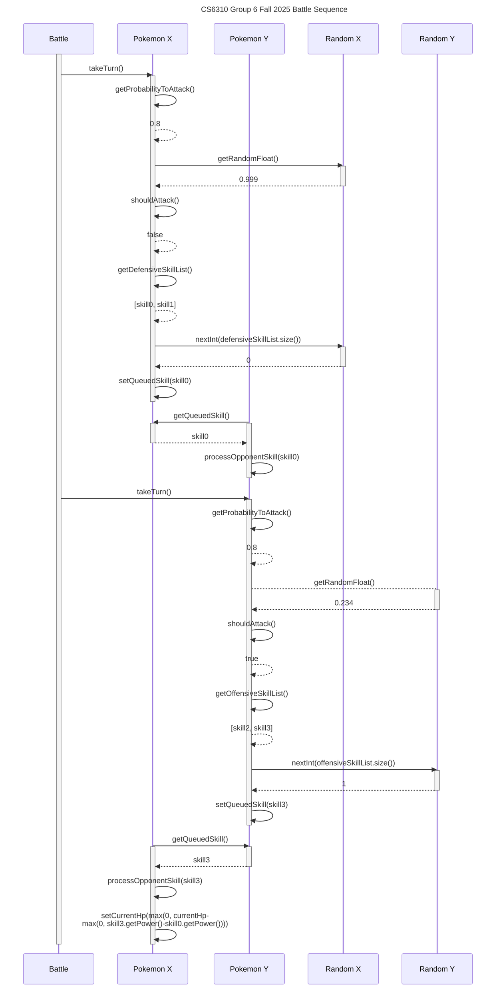

Sequence Diagram 2: Pokémon Y attacks Pokémon X, Pokémon X defends itself.

```mermaid
---
title: CS6310 Group 6 Fall 2025 Battle Sequence 
---
sequenceDiagram
    participant battle as Battle
    participant pokemonX as Pokemon X
    participant pokemonY as Pokemon Y
    participant randX as Random X
	participant randY as Random Y
    activate battle

	battle ->> pokemonX: takeTurn()
	activate pokemonX
	pokemonX ->> pokemonX: getProbabilityToAttack()
	pokemonX -->> pokemonX: 0.8
	pokemonX ->> randX: getRandomFloat()
	activate randX
	randX -->> pokemonX: 0.999
	deactivate randX
	pokemonX ->> pokemonX: shouldAttack()
	pokemonX -->> pokemonX: false
	pokemonX ->> pokemonX: getDefensiveSkillList()
	pokemonX -->> pokemonX: [skill0, skill1]
	pokemonX ->> randX: nextInt(defensiveSkillList.size())
	activate randX
	randX -->> pokemonX: 0
	deactivate randX
	pokemonX ->> pokemonX: setQueuedSkill(skill0)
	deactivate pokemonX
	
	pokemonY->>pokemonX: getQueuedSkill()
	activate pokemonY
	activate pokemonX
	pokemonX-->>pokemonY: skill0
	deactivate pokemonX
	pokemonY->>pokemonY: processOpponentSkill(skill0)
	deactivate pokemonY
	
	battle->>pokemonY: takeTurn()
	activate pokemonY
	pokemonY ->> pokemonY: getProbabilityToAttack()
	pokemonY -->> pokemonY: 0.8
	pokemonY --> randY: getRandomFloat()
	activate randY
	randY -->> pokemonY: 0.234
	deactivate randY
	pokemonY ->> pokemonY: shouldAttack()
	pokemonY -->> pokemonY: true
	pokemonY ->> pokemonY: getOffensiveSkillList()
	pokemonY -->> pokemonY: [skill2, skill3]
	pokemonY->> randY: nextInt(offensiveSkillList.size())
	activate randY
	randY -->> pokemonY: 1
	deactivate randY
	pokemonY ->> pokemonY: setQueuedSkill(skill3)
	deactivate pokemonY

	pokemonX->>pokemonY: getQueuedSkill()
	activate pokemonX
	activate pokemonY
	pokemonY-->>pokemonX: skill3
	deactivate pokemonY
	pokemonX->>pokemonX: processOpponentSkill(skill3)
	pokemonX->>pokemonX: setCurrentHp(max(0, currentHp-<br/>max(0, skill3.getPower()-skill0.getPower())))
	deactivate pokemonX

    deactivate battle
```

