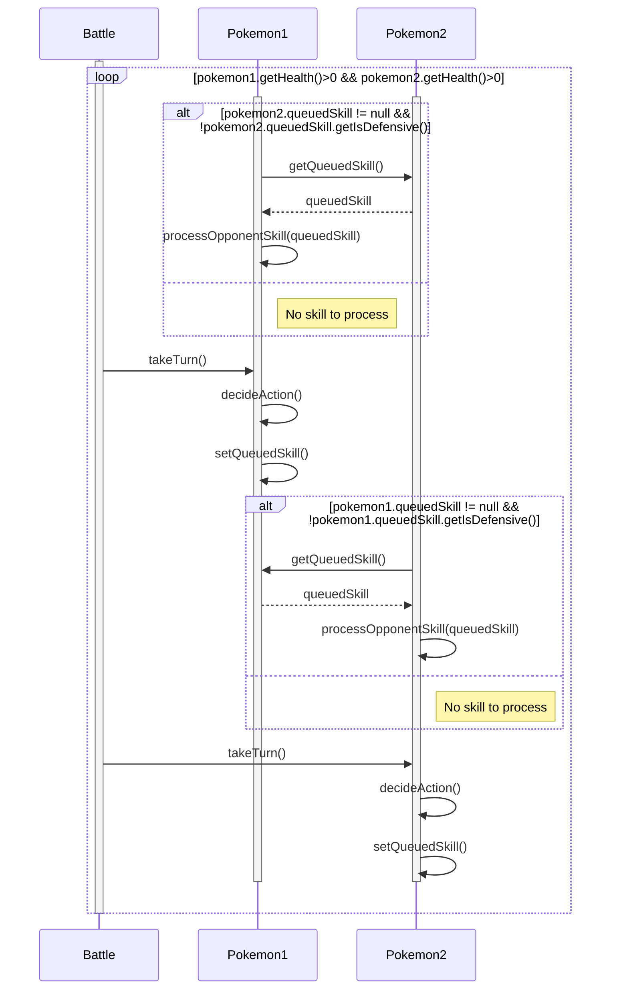

```mermaid
sequenceDiagram
    participant battle as Battle
    participant pokemon1 as Pokemon1
    participant pokemon2 as Pokemon2

    activate battle
    loop pokemon1.getHealth()>0 && pokemon2.getHealth()>0
	    activate pokemon1
	    activate pokemon2
        %% Pokemon1 phase
        alt pokemon2.queuedSkill != null && !pokemon2.queuedSkill.getIsDefensive()
            pokemon1->>pokemon2: getQueuedSkill()
            pokemon2-->>pokemon1: queuedSkill
            pokemon1->>pokemon1: processOpponentSkill(queuedSkill)
        else
            note right of pokemon1: No skill to process
        end
        battle->>pokemon1: takeTurn()
        pokemon1->>pokemon1: decideAction()
        pokemon1->>pokemon1: setQueuedSkill()

        %% Pokemon2 phase
        alt pokemon1.queuedSkill != null && !pokemon1.queuedSkill.getIsDefensive()
            pokemon2->>pokemon1: getQueuedSkill()
            pokemon1-->>pokemon2: queuedSkill
            pokemon2->>pokemon2: processOpponentSkill(queuedSkill)
        else
            note right of pokemon2: No skill to process
        end
        battle->>pokemon2: takeTurn()
        pokemon2->>pokemon2: decideAction()
        pokemon2->>pokemon2: setQueuedSkill()
        deactivate pokemon1
        deactivate pokemon2
    end

    deactivate battle
```

