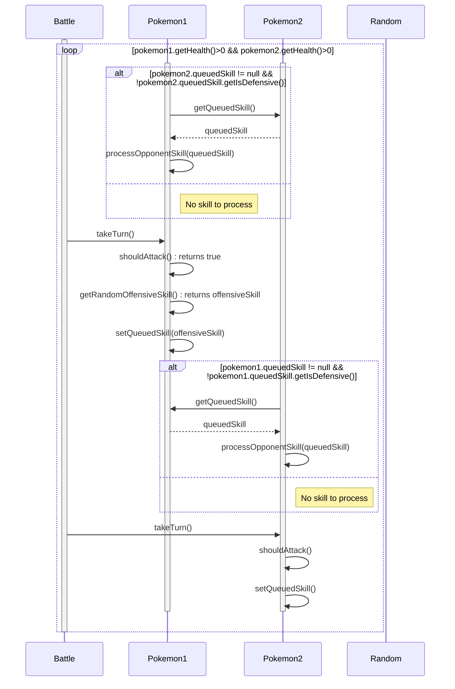

**TODO:**
- Show basic implementation for processOpponentSkill
	- Apply the damage from the opponents move (that skills power)
	- If we're defending reduce the incoming damage
- Show implementation details for should attack, and add calls to random
	- Show getting the current health ratio
	- Show getting aggressiveness value
	- Show random generation and compare against aggressiveness 
	- return true / false
- Show implementation for getRandomOffensive / Defensive Skills (Choosing randomly from the list)
	- Show filtering list on the isDefensive boolean
	- Show random selection from the filtered list