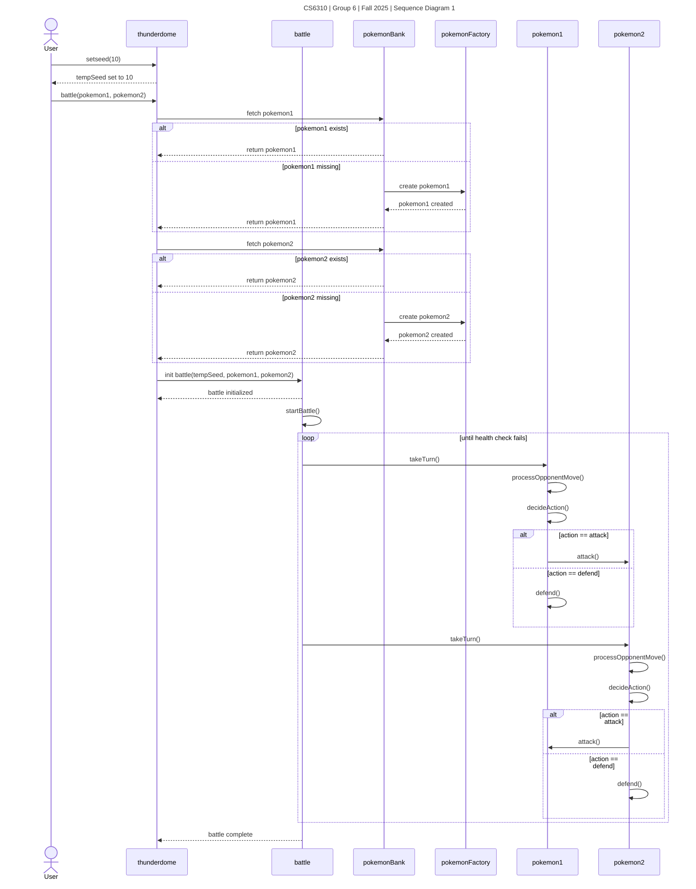

```mermaid
---
title: CS6310 | Group 6 | Fall 2025 | Sequence Diagram 1
---
sequenceDiagram
    actor User
    participant thunderdome
    participant battle
    participant pokemonBank
    participant pokemonFactory
    participant pokemon1
    participant pokemon2

    User ->> thunderdome: setseed(10)
    thunderdome -->> User: tempSeed set to 10

    User ->> thunderdome: battle(pokemon1, pokemon2)

    thunderdome ->> pokemonBank: fetch pokemon1
    alt pokemon1 exists
        pokemonBank -->> thunderdome: return pokemon1
    else pokemon1 missing
        pokemonBank ->> pokemonFactory: create pokemon1
        pokemonFactory -->> pokemonBank: pokemon1 created
        pokemonBank -->> thunderdome: return pokemon1
    end

    thunderdome ->> pokemonBank: fetch pokemon2
    alt pokemon2 exists
        pokemonBank -->> thunderdome: return pokemon2
    else pokemon2 missing
        pokemonBank ->> pokemonFactory: create pokemon2
        pokemonFactory -->> pokemonBank: pokemon2 created
        pokemonBank -->> thunderdome: return pokemon2
    end

    thunderdome ->> battle: init battle(tempSeed, pokemon1, pokemon2)
    battle -->> thunderdome: battle initialized

    battle ->> battle: startBattle()

    loop until health check fails
        battle ->> pokemon1: takeTurn()
        pokemon1 ->> pokemon1: processOpponentMove()
        pokemon1 ->> pokemon1: decideAction()
        alt action == attack
            pokemon1 ->> pokemon2: attack()
        else action == defend
            pokemon1 ->> pokemon1: defend()
        end

        battle ->> pokemon2: takeTurn()
        pokemon2 ->> pokemon2: processOpponentMove()
        pokemon2 ->> pokemon2: decideAction()
        alt action == attack
            pokemon2 ->> pokemon1: attack()
        else action == defend
            pokemon2 ->> pokemon2: defend()
        end
    end

    battle -->> thunderdome: battle complete


```

