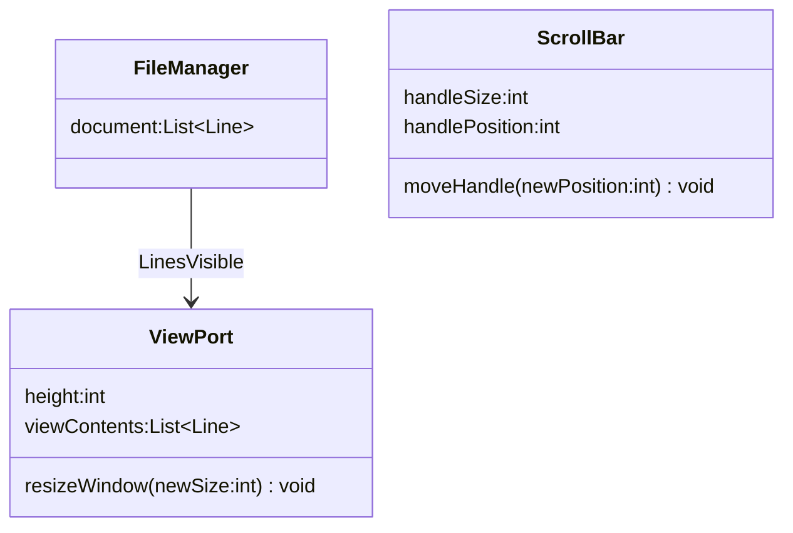

Professor: Mark Moss
Teaching Assistant: Matthew Carter

Note to other students -- Do not use MermaidJS to render your diagrams, it's not flexible enough to support the requirements of this course.

Course Objectives:
- Express the anlaysis and design of an application using UML
- Specify functional semantics of an application using OCL
- Specify and evaluate software architectures
- Understand and apply object-oriented design techniques
- Select and use appropriate software design patterns
- Understand and participate in design reviews

Exam 1:
- Rank 3 submitted designs and discuss their strengths and weaknesses.
## Designing a Text Browser Application
### Summary:
- Problem: Browsing the text in a computer file.
- There is no graphical user interface (GUI) toolkit.
- Devise a cleanly structured solution
### Solution Component Notes
Assuming you had a GUI Library such as Java Swing or SWT, at a minimum what atomic GUI components would you need to build your TextBrowser?
- The options are:
	- Checkbox
	- Window
	- Progress Bar
	- Combo Box
	- Scrollbar
	- Radio Button
- A window and a scrollbar would be necessary.
- Although it isn't in the GUI toolkit, we would also need a File Manager.
- Assuming we aren't able to hold the entire file in memory, we would have to read from disk.
	- So we need a module that can retrieve a limited length, consecutive subsequence of the file's lines from disk.
- The window component is called the **ViewPort** and is needed to display the textual content graphically. 
	- Assume that the ViewPort displays an integer number of lines.
	- Assume that it can be resized between 1-100 lines.
	- All text is in the same font and point size.
- The **ScrollBar** is needed to give the user some way to access different parts of the file.
	- The user can set the position of the **Handle** in the **Tray** to scroll through the file.
### Analysis Diagrams
- **Note that an analysis model is not a design. It describes at a high level what actions the user can take, and how they can interact with the application.**
- Imagine how the user will use the intended application or solution.
	- Determine the behavior of the TextBrowser and it's structural elements based on that.
	- These descriptions are called **Use Cases**
- A **Use Case** is how the user will use the intended solution.
- Use Cases for this application:
	- Reading the text
	- Moving the handle
	- Changing the ViewPort size
- Once the use cases and behaviors are defined for the application, we can construct an **Analysis Model**
	- We'll use UML to express our analysis models.
	- Rectangles for classes.
	- Each rectangle is divided into three sections
		- Name
		- Attributes - Characteristics of the application that the user can see or interact with.
			- These are also called **Percepts**.
		- Operations - Actions the user can take to interact with the application
	- Lines between the rectangles denote component **Relationships**.
- There are three kinds of **Relationships**:
	- **Associations**
	- **Aggregations**
	- **Generalizations**
- In our TextBrowser, what components are affected by the two user actions `moveHandle()` and `resizeViewPort()`? Indicate the components involved for each action and describe the relationship.
	- `moveScrollBar()`
		- Need to read a different sequence of lines.
		- Need the handle to visually move.
	- `resizeViewPort()`
		- Need different number of lines.
		- Change the handle size (height) and position.
		- Change the ViewPort size.

- At any given moment in time, what is the number of lines actually displayed in the ViewPort as a function of the window's size and the number of lines in the file?
	- `numberOfLinesDisplayed = minimum(windowSize, numberOfLinesInFile)`
	- We can call this the lines visible association, and it defines the relationship between the ViewPort and the FileManager.
	- UML is unable to display this information, so we'll use **Obstraint Constraint Language** (OCL)

- Using MermaidJS, here is an example of an Analysis Model for our TextBrowser application:


- Note that MermaidJS does not support OCL, so I may switch to PlantUML which apparently does. Edit: I will be switching to a different diagraming tool.
```ocl
context LinesVisible inv:
	ViewPort : viewContents->size() =
	ViewPort : height.min(FileManager : document->size())
```
- The LinesVisible association indicates that the contents of the ViewPort must come from the FileManager, but doesn't specify what lines.
	- The lines are detemrined by the position of the ScrollBar handle. 
	- If the top of the handle is halfway down the tray, you'd expect to be halfway down the file.
	- This can be expressed with the following:
		- `linesVisible = from topPositionOfHandle to (topPositionOfHandle + windowSize)`
- There is therefore a 'Ternary' association among all three components. We'll call this association Displays.
	- This is represented by a diamond in the UML diagram (relationship with multiple participants)
![[Pasted image 20250819203222.png]]
```ocl
context displays inv:
		  let topLineNumber = ScrollBar : 
		  handlePosition * FileManager : document->size()
		  in ViewPort : viewContents = FileManager : document -> subsequence(topLineNumber, topLineNumber + ViewPort : viewContents->size() - 1)
```
- The final property has to do with the size of the handle of the ScrollBar, we'll call it `handleProportion`.
	- Assume a `handleProportion` of 1 fills the tray.
	- `handleProportion = numberOfLinesDisplayed / fileSize`
	- HandleProportion can now be represented as a ternary relationship as well.
	- ![[Pasted image 20250819202859.png]]
	- Note that you need to account for any divide by zero issues.
	- What happens if you scroll to the end of the file, and then increase the size of the ViewPort? 
		- Add blank lines, or the line at the bottom of the file sticks to the bottom, and we see more lines scroll in from the top.

