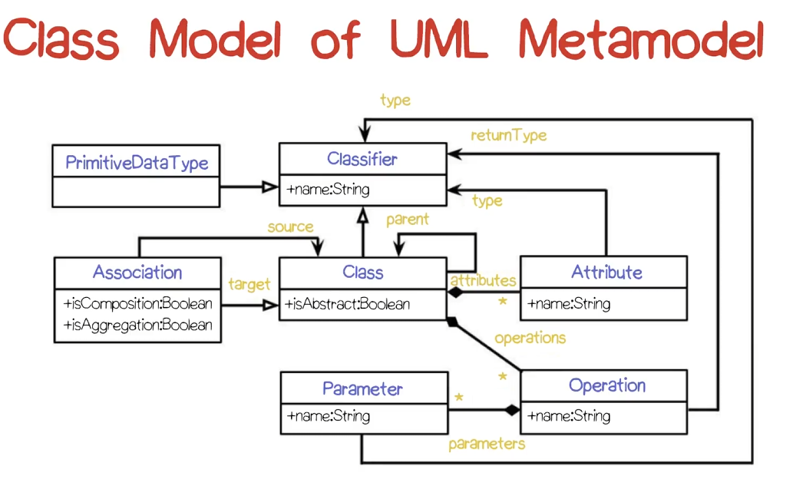

# UML Review
- Unified Modeling Language (UML) is standardized by the Object Management Group (OMG)
- Used for analysis or design models

## Diagram Types
We will concentrate on 3 or 4 types in UML 2.0, but there are 14 diagram types. Strive to use the diagram(s) that make the most sense for your project.

Benefits of using design diagrams:
- Improved communication
- Support for existing methods
	- Design diagrams can aid in review of methods in it. *This isn't super clear what the professor means*.
- Tool support
	- By using specific types of diagrams, you might find tools that can read those diagrams and inform the user when a particular piece is missing. *I assume he means something like Camunda in this case.*

Note that in the video, "Maintainability" means "keeping the diagram up to date." This would actually be a negative (con) when using design diagrams.

The diagram types have two main categories:
- **Structural** - Represent the pieces of the system that are always there, and the relationships among them.
- **Behavioral** - Represent the executions of the system. Multiple diagrams might be needed for multiple behaviors in a system.

Reminder: UML Classes have three segments separated by a horizontal line. 
- The first segment contains the class name
- The second segment contains attributes and **percepts (attributes that are visible to the user)**
- The third segment contains methods or operations

**UML Relationships**
There are three main categories of relationships in UML:
- Dependencies: "X uses Y" - represented by a dashed arrow
- Associations: "X affects Y"- represented by a straight line
	- A diamond can be added to indicate a "has a" or aggregation relationship
- Generalizations: "X is a kind of Y" - represented by a open arrowhead and solid line
- 
- 
**Structural Diagram Type List**
- **Class Diagram**
	- The most popular diagram type
	- Also called a **Static Model** or **Class Structure Diagram**
	- Displays the classes of a project and the relationship between those classes
- **Object Diagram**
	- Conveys object instances and links instead of classes and relationships
	- Used to display a specific use of a class diagram (more specificity)
	- May show attribute values rather than just fields
	- 
- **Composite Structure Diagram**
	- Conveys internal structure of a class
	- 
	- This diagram displays what the class requires and what it provides
- **Component Diagram**
	- A static implementation view
	- "A component is a physical, replaceable part of a system that packages implementation and conforms to and provides the realization of a set of interfaces"
	- Usually used to model code entities (from a library)
	- Can be used to convey architecture.
	- 
- **Deployment Diagram**
	- Nodes in this diagram represent a computational device
	- Arcs indicate communication between those devices
	- 
- **Profile Diagram**
	- Higher level than the other diagram types
	- This is generally used as a UML diagram of another UML diagram that abstracts away certain details. It then becomes a **meta-model**.
	- Allows for extension of basic UML notation via UML profiling
	- 
UML 2.0 packages (organizing mechanicsms) have their own diagram, providing **namespace scoping**. So that each package can have it's own set of names without worrying about collisions (other packages having the same names).
- System is the top-level package
- Dependency arrows between packages indicate the existence of dependencies
- *Note that this is a UML 2.0 Example Diagram* 

**Table of Structural Diagrams:**

| UML Structure Diagram Types | Descriptions                                            |
| --------------------------- | ------------------------------------------------------- |
| Class                       | Component and structural properties                     |
| Composite Structure         | Internal structure and possible interactions among them |
| Component                   | Organization of physical software components            |
| Deployment                  | Physical system resources and how they map to hardware  |
| Object                      | Static structure at a particular point in time          |
| Package                     | Logical groupings and dependencies                      |
| Profile                     | Extensions to the UML meta model                        |
*Note that there is a lot of similarity between these terms. This is because the diagrams have a lot of overlap themselves.*

Which diagrams can be used to display system architecture:
- Class Diagram
- Component Diagram
- Package Diagram
- Deployment Diagram

**Behavior Diagrams**
Behavior Diagrams are concerned with a particular behavior of a system. Multiple might be required to convey the overall idea of a system.

**Behavior Diagram Types**
- **Use Case Diagrams**
	- A sequence of user-visible actions along with system responses
	- Useful for defining requirements
	- Think of JIRA stories as a diagram
	- Contains stick figures which denote external actors
	- Ovals represent use cases
	- Lines without annotations indicate participation
	- Available annotations are 'extends' and 'uses'
		- Extends is used to show other contingencies
		- Uses is like a subroutine or method call
	- 
	- These diagrams can also be represented as tables:
	- 
- **Context Diagrams**
	- Not a part of UML, but does provide interesting capabilities
	- A single circle representing the system, with rectangles representing system actors
	- Lines indicate the flow of data
	- 
- **Sequence Diagram**
	- Used to convey a single use case
	- Columns represent participants or objects in a system
	- Time marches down the diagram, and horizontal lines represent the passing of a message or data.
	- 
- **Communication Diagram**
	- Similar to sequence diagrams
	- Note, the example diagram is absolutely awful to read. Not a fan of this one.
	- The numbers on the annotations indicate the order in which the messages take place
		- 1. `create()`
		- 2. `commited = setAction(a,d,o)`
			- 2.1. `setValues(d, 3.4)`
			- 2.2 `setvalues(a,"CO")`
		- 3. `destroy()`
	- 
- **Activity Diagram**
	- This diagram is a variant of a state machine, where multiple states can be active
	- Transitions are typically triggered by activity completion
	- Used to model workflows, process synchronization, and conccurency
	- 
	- Start at the circle, split at each diamond (representing a token and concurrency)
	- The black rectangles are synchronization points. Once Debit Account and Award Bonus finish, they synchronize before proceeding to the next step.
- **Interaction Overview Diagram**
	- An activity diagram where the nodes correspond to lower level interaction diagrams.
	- 'Ref' denotes a specific interaction occurence
	- 
- **UML Timing Diagram**
	- Allows for performance overviews and mapping actions to specific times
	- 
- **State Diagram**
	- The most powerful and complex type of behavioral diagram
	- Also called **State Charts**
	- Convey extended finite state machines
	- 

**Table of Behavioral Diagrams**

| UML Behavioral Diagram Types | Descriptions                                           |
| ---------------------------- | ------------------------------------------------------ |
| Activity                     | Flow of control from activity to activity              |
| Sequence                     | Interaction of classes in terms of exchanging messages |
| Communication                | Object interaction in terms of numbered messages       |
| Interaction Overview         | Synthesis of lower level behavioral diagrams           |
| Timing                       | Rotated sequence diagram                               |
| Use Case                     | System functionality provided to external actors       |
| State                        | Dynamic behavior in response to stimuli                |
## Object Constraint Language (OCL)
- A textual addition to UML that provides more concise specification 
- Applicable to Class and State Chart Diagrams to further specify behavior and details
- 
- **Context** describes the class and operation
- **Pre** defines a pre-condition
- **Post** defines what must be true after the execution of the operation

## Example of UML Metamodel
