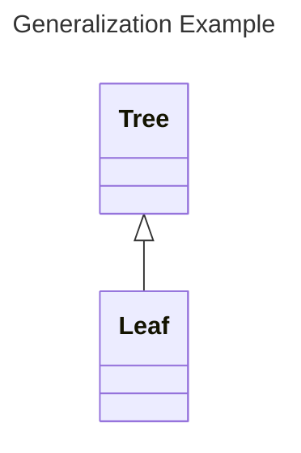
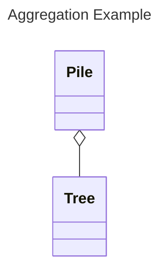
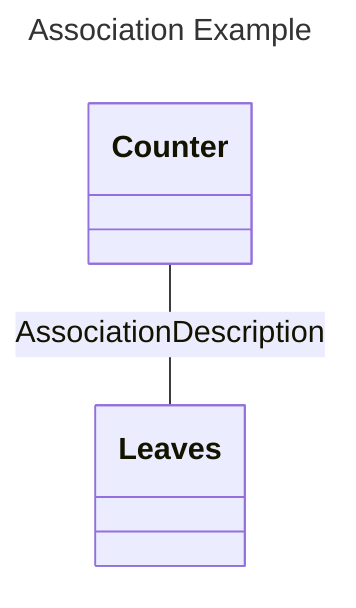

# Object Oriented Analysis (OOA)
OOA is a requirements analysis technique that focuses on modeling real-world objects based on their descriptions. Prior to OOA, the predominant method was structured design (or functional decomposition).
- Objects are a better starting point for analysis than functions because:
	-  During maintenance, functions change more frequently than objects
	- Objects are more stable than functions, since behaviors may change but object representations change much less frequently

The goal of OOA is to use identified words to build up descriptions of classes and their relationships:
- Nouns represent classes
- Action verbs represent operations
- Adjectives represent attributes
- Stative verbs represent relationships ('has a', 'is a')

**OOA Process / Technique**
1. Obtain or prepare a textual description of a problem, and identify all the nouns
2. Organize the nouns into groups to become candidate classes
3. Identify all adjectives, and assign the adjectives as attributes of the candidate classes
4. Identify all verbs, differentiating action verbs from stative verbs
5. Assign the action verbs as operations of classes, and assign stative verbs as attributes of classes or relationships
Note that in this process, words will be duplicated and referenced in different ways. Try to condense and just have one copy of the given word.

This process is inherently incremental. Design, requirements, and implementation will grow together.

**OAA Relationships**
- **Generalization** - Indicates that the child class is a kind of instance of the parent class (i.e. Dog is a type of Animal, Leaf is a type of Tree)
	- Indicated by 'kind of' or 'type of' in the text description

- **Aggregations** - A collection or set of things.
	- Indicated by 'consist of', 'part of', 'contains', 'has', 'incorporates', and 'belongs to'
	- The Pile class in the example has a tree (or collection of trees)

- **Association** - 
	- Represents that one class is associated with another, best described through examples:
		- An employee is associated with a department
		- A teacher teaches in a classroom
		- Can almost be thought of like a foreign key in SQL

**Counting Leaves Problem Diagram:**
- My main issue with this diagram is that it includes Leaf as its own class representation
- In actual implementation, leaves are just single node trees
