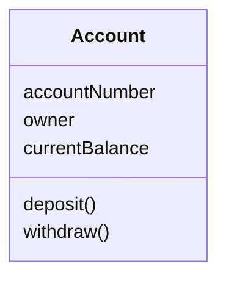
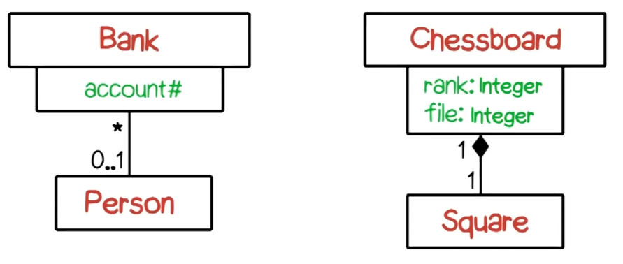
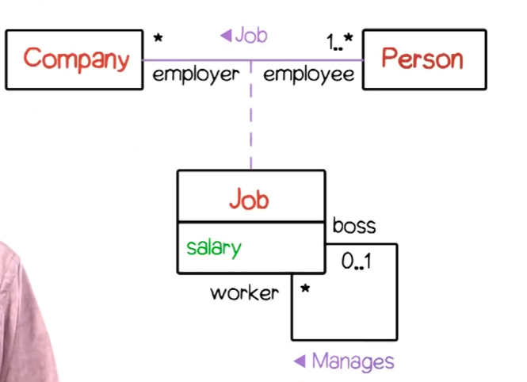
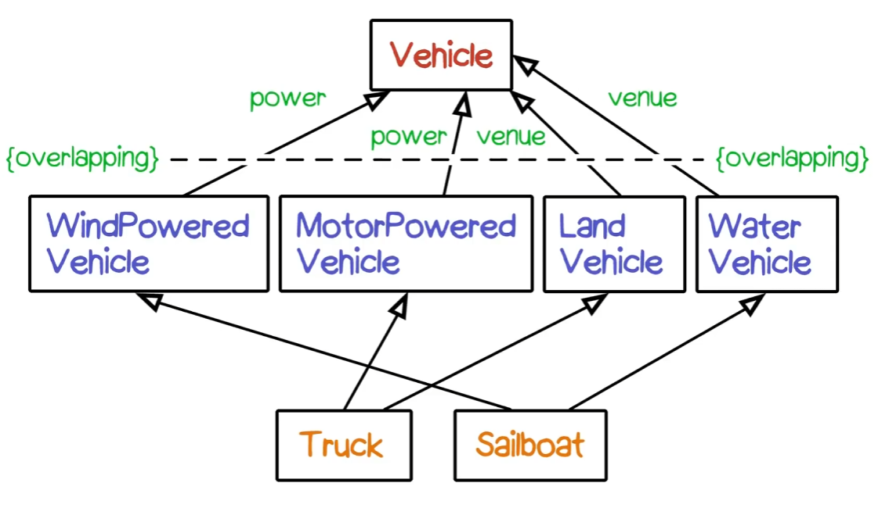
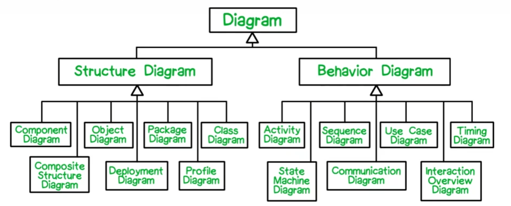
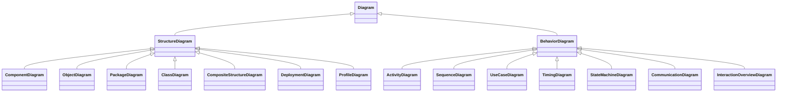

# UML Class Models
**Classes** are a description of a similar set of instances. This could include:
- Domain Objects
- Roles
- Events
- Interactions

**Abstract Classes** describe properties of subclasses, but can never have their own instances.
If a class is abstract, you can represent that in a class diagram by making its name *italic*.

**Stereotypes** are a way to extend the base UML language. They are represented with double angle brackets `<<stereotype>>`. Examples would be `<<query>>` and `<<update>>`.

**Visibility Options**
- Public (+)
- Private (-)
- Protected (#)
- Package (~)

You can give additional properties to attributes with {} notation, such as `{frozen}`.
You can also give additional properties to operations with {} notation, such as `{query}, {concurrency}, {abstract}`. You can also note that an attribute or operation has class scope (that it's static).

**Bank Account Example**

**Advanced Features of Class Models**
- Interfaces
	- UML can describe interfaces by showing - 
		- What it requires from the rest of the system
		- What it provides to the rest of the system
- Parameterized Classes
	- Correspond to Java generics or C++ templates. They provide a way of describing collection classes. `Set<T>`.
- Nested Classes
- Composite Objects
	- Objects that contain other objects would be represented with class rectangles within another class rectangle.
	- This one is confusing, why wouldn't you just have the name for that object as an attribute?

**UML Relationships**
- Association
	- "People drive vehicles"
	- Denoted by solid lines connecting two classes
	- **Aggregation** and **Composition** are parts of association
		- Aggregation is very common in UML diagrams. It is denoted by an open diamond.
		- Composition means that if the parent object is destroyed, its constituent objects are also destroyed (it is responsible for the lifetime of its parts). 
	- **Qualifiers** are represented with a rectangle, and represent a way to access an aggregation or relationship
		- In this example, a person accesses their bank account through their account number, and a chess square is accessed through its rank and file.
		- 
	- **Association Classes** are an association that has some attributes
		- In this example, salary isn't necessarily a property of the Person or the Company. It's better represented as a attribute of the particular job instance, which is connected to person and company.
		- Note that job has an association with itself. This is called a **Recursive** association. One job might manage another job, and there would be roles for the boss / worker.
		- 
- Generalization
	- "A car is a kind of vehicle"
	- Indicated by a solid line ending with a triangle (or in other words, like anyone else would call it, an **Arrow**).
	- Generalization is not the same as inheritance in OOP.
	- UML supports multiple parent and child classes linked to each other, unlike Java.
	- In the following diagram, Vehicle has four subclasses.
	- Trucks are motor powered vehicles, but also are land vehicles. It has two parent classes.
	- 
- Dependency
	- "A car is dependent on pollution control laws"

Given these four classes, write whether the relationship is **Composition**, **Aggregation**, or a **General Association**.
*Note: For this exercise, the order within each pair should not be considered.*
- Courses and Students
	- Courses can exist without students, and students can exist without courses
	- A course can have a group of students though, so this is **Aggregation**
- Person and Spouse
	- A spouse depends on the existence of a person, but are also themselves a person.
	- This is a **General Association**. A person doesn't need a spouse, and isn't composed of a spouse. Likewise in the other direction, although a spouse would need another spouse / person (which makes this one a little weird).
- Bank Account and Patron
	- This is an **Aggregation**. A patron can have a bank account, or several.
- Fonts and Glyphs
	- Fonts are comprised of glyphs, so this is clearly **Composition**

**Superclasses and Subclasses (Advanced Generalization)**
- Sets of subclasses are **Overlapping** if an instance of a subclass can belong to multiple parent classes. In the example above, Truck and Sailboat are disjoint.
- Sets of subclasses are **Disjoint** if their instances can only be related to one subclass.
- Sets of subclasses are **Incomplete** if they do not cover all possible instances of the parent class. If the available subclasses were BaseballPlayers, SoccerPlayers, and HockeyPlayers, that would be incomplete because there are athletes that play others sports.

Same Diagram with Mermaid:
