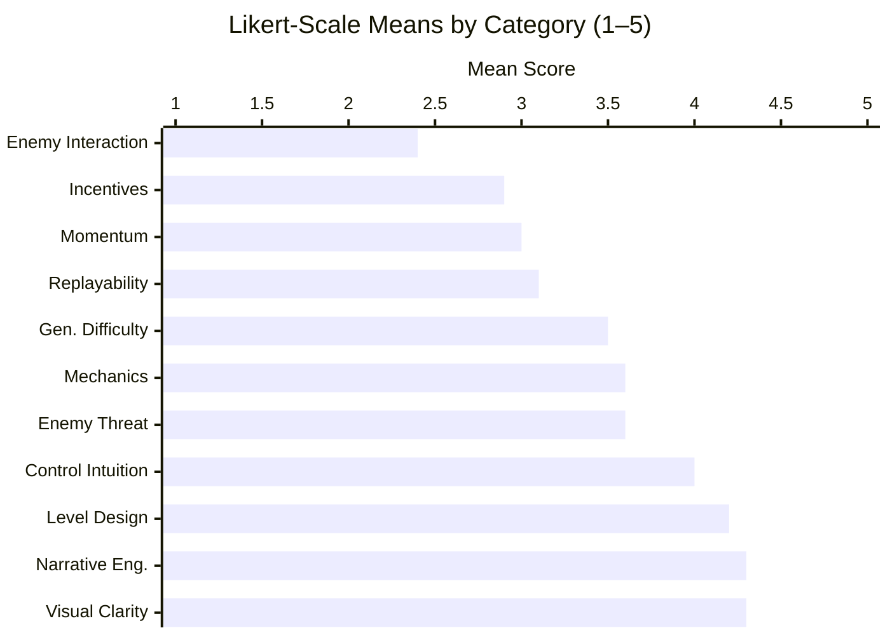
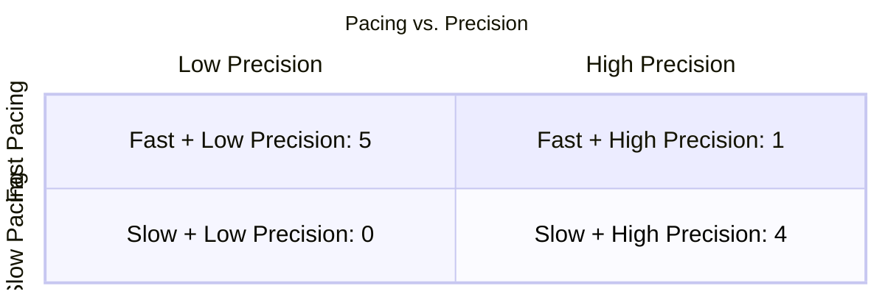
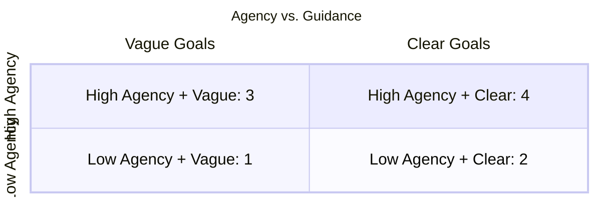

# DeadEx: Dungeon Delivery — Playtest Results & Analysis

**Team:** Thought Cabinet (Sean, Foster, Henrique, Marcel, and Louie)
**Date:** April 12, 2026

---
## 1. Design Questions

### Primary Design Question

**Can players discover and effectively use DeadEx's core mechanics—particularly the Recall/Throw system and momentum-based gap crossing—without explicit tutorials or on-screen prompts?**

The central mechanic of DeadEx is the package: players carry, throw (F), and recall (R) it, and can combine recall with jumps to cross gaps via momentum transfer. This mechanic is never explicitly taught. The game's design philosophy relies on players organically discovering these interactions through play. This playtest investigates whether that implicit teaching approach succeeds or whether it creates frustration that undermines the experience.

**Justification:** If players cannot discover the throw/recall/momentum loop on their own, the game's core identity breaks down. The package is not just a delivery objective—it doubles as a traversal tool, a combat option, and a scoring mechanism (package health). A failure in discoverability here affects every downstream system: level completion, enemy interaction, collectible gathering, and replayability. Understanding where players get stuck in this discovery chain directly informs whether the team needs to add tutorials, contextual hints, or redesign the onboarding sequence.
### Secondary Design Question

**Do players perceive enemies and collectibles as meaningful incentives that shape their decision-making, or are these systems ignored in favor of simply completing the level?**

**Justification:** DeadEx features ghost enemies, stamps (collectibles), and a package-health scoring system. If players avoid engaging with enemies entirely and ignore stamps, then these systems represent wasted development effort and the game reduces to a linear traversal puzzle. Understanding player motivation around these systems informs whether the team should invest in deeper enemy mechanics, collectible rewards, or scoring feedback in future iterations.

---
## 2. Approach & Playtest Methods

### Methodology
The playtest followed a structured Think-Aloud observational protocol combined with a Likert-scale survey and structured interview. The mixed method approach captures both real-time behavioral data (what the player do) and reflective data (what players think).

### Participants
- 10 survey respondents completed the post-session questionnaire.
- 10 observed sessions were documented with notes on the playtesters think-aloud results.
- Participants were recruited from peers; no personally identifying information was recorded.

### Observation Protocol
Administrators followed the scripted playtest procedure:
1. **No upfront instruction:** Players were given no control guidance at the start. This tests the primary design question directly—organic discoverability.
2. **Assistance protocol:** Administrators only intervened when a player explicitly asked for help or was visibly stuck and unable to progress. 
3. **Think-Aloud capture:** Administrators recorded real-time player commentary, noting moments of confusion, excitement, and discovery.
4. **Performance metrics:** Stamps collected vs. available and final package health percentage were recorded per level. The end screen of each level is programmed to provide this data for us.
### Survey Instrument
The post-session survey collected:
- **11 Likert-scale items** (1–5) covering control intuition, mechanics, momentum, enemy interaction, enemy threat, visual clarity, level design, incentives, replayability, narrative engagement, and general difficulty.
- **2 experience-matrix placements** (Pacing vs. Precision; Agency vs. Guidance) for holistic feel assessment.
- **6 open-response questions** on fun rating (1–10), highlights, frustrations, aesthetics, movement refinement, and game refinement.

---

## 3. Results Summary & Analysis

### 3.1 Overall Experience
The mean **fun rating was 7.4 / 10** (range: 5–9, SD ≈ 1.2), indicating a generally positive reception. No respondent rated the experience below 5, suggesting the core concept is sound even where execution gaps exist.

### 3.2 Likert-Scale Results

| Category             | Mean (1–5) | Interpretation                                  |
| -------------------- | ---------- | ----------------------------------------------- |
| Control Intuition    | 4.0        | Agree — movement felt intuitive                 |
| Visual Clarity       | 4.3        | Agree — animations matched actions              |
| Narrative Engagement | 4.3        | Agree — dialogue was engaging                   |
| Level Design         | 4.2        | Agree — levels were enjoyable                   |
| Mechanics (Recall)   | 3.6        | Neutral/Agree — recall usable but not seamless  |
| Enemy Threat         | 3.6        | Neutral/Agree — enemies somewhat threatening    |
| General Difficulty   | 3.5        | Neutral — difficulty was acceptable             |
| Replayability        | 3.1        | Neutral — stats alone didn't drive replays      |
| Momentum             | 3.0        | Neutral — momentum mechanic poorly understood   |
| Incentives (Stamps)  | 2.9        | Neutral/Disagree — weak motivation to collect   |
| Enemy Interaction    | 2.4        | Disagree — throwing at enemies felt ineffective |

**Key finding:** The strongest ratings cluster around presentation and feel (visual clarity, narrative, controls, level design), while the weakest ratings target the package-as-weapon system (enemy interaction: 2.4) and collectible motivation (incentives: 2.9). The momentum mechanic—central to traversal—sits at a neutral 3.0, confirming the primary design question concern.

### 3.3 Experience Matrices
**Pacing vs. Precision:**

| | High Precision | Low Precision |
|---|---|---|
| **Fast Pacing** | 1 | 5 |
| **Slow Pacing** | 4 | 0 |

Players split between "Fast & Forgiving" (5) and "Slow & Precise" (4), with one outlier at "Fast & Precise." This polarization suggests that player skill level strongly determines perceived pacing—experienced players breeze through while novices methodically work through obstacles.

**Agency vs. Guidance:**

|                 | Clear Goals | Vague Goals |
| --------------- | ----------- | ----------- |
| **High Agency** | 4           | 3           |
| **Low Agency**  | 2           | 1           |

The majority (7/10) reported high player agency. However, 4 of those 7 felt goals were vague—they chose their own path but weren't sure what they were supposed to be doing. This aligns with observer notes showing players unsure whether stamps matter or what the package health bar represents.

### 3.4 Observed Completion Times
Level 1 completion ranged from 1:29 to 7:00 among players who finished, while L2 (non-experienced) could not complete Level 1 without direct assistance at both the ghost room and the gap. This stark contrast underscores how heavily completion depends on prior gaming literacy. The variance is largely explained by discovery time and comfort with implicit controls: FW01 received an early control nudge, while SD2 explored independently and left the package behind, and L1 spent 5 of their 7 minutes on the gap alone despite being an experienced gamer.

Level 2 (ice level) shows a similar skill-dependent split. Experienced players completed it in 2:27–4:00, while L2 required 13 minutes (with 8 minutes spent in the maze alone). The ice mechanic itself was more self-explanatory than the recall/momentum system—L1 noted *"Ice is actually fun"* and *"This changes everything"*—but the maze section created a significant difficulty spike for less experienced players.

### 3.5 Stamp Collection & Package Health
FW02 achieved perfect Level 1 collection, demonstrating that completionist behavior *does* emerge in some players. However, survey data shows incentives scored only 2.9/5—players who collected stamps did so out of personal exploration instinct, not because the game rewarded it.

### 3.6 Mechanic Discoverability (Primary Design Question)
**Critical finding:** No player organically discovered the Momentum Jump. All required administrator hints. The non-experienced player (L2) could not leave the ghost room or cross the gap without direct assistance, and became visibly frustrated during repeated failed attempts. Even the experienced gamer (L1) spent 5 minutes on the gap and ultimately needed help.

No player in any observed session used the package offensively against enemies, matching the survey's 2.4/5 enemy interaction score. Players actively avoided throwing the package because it takes damage—creating a psychological conflict between "protect the delivery" and "use package as weapon."

FW01 explicitly stated: *"Doesn't want to throw because it takes damage… feels need to protect the package."* MS1's observer noted the player was *"unable to understand what was the delivery package"* and *"thought the stickers were the package,"* reaching the middle of the stage without ever picking it up. This indicates that the package's role is fundamentally unclear to some players, compounding the discoverability problem.

### 3.7 Qualitative Themes from Open Responses & Observations
**Strengths (most cited):**
- Narrative/dialogue tone and humor (L1 found intro "funny and engaging")
- Visual style and character design
- Recall/momentum mechanic *once discovered* (L1: *"This changes everything"*; MS2 *"liked the momentum mechanic"*)

**Frustrations (most cited):**
- Lack of control instructions or tutorial (L2 asked *"What am I supposed to do?"*; MS1 couldn't identify the package)
- Momentum/recall timing difficulty
- Package purpose unclear — MS1 thought stamps were the package, reached mid-level without it; MS2 noted *"not clear you are supposed to deliver the package"*
- Enemy interaction feels pointless 
- No audio/sound effects (4/4 early sessions + MS2 noted *"no sounds"*)
- Ice maze difficulty spike L2 spent 8 minutes in maze alone, said *"I need a drink after that"*)
- Ghost vision cone clipping through walls 
- Avatar/model mismatch — MS2: *"Skeleton avatar pic does not match model"*; FW01 noted skin tone mismatch with mail lich figure
- Start button inconsistency — MS2: *"Start does not click sometimes"*; FW01: *"Click start is buggy"*

**Most requested additions:**
- On-screen control prompts or tutorial level
- Sound effects and music
- Stamp counter during gameplay
- More levels and content 
- More meaningful enemy defeat rewards
---
## 4. Action Items & Future Work

### Action Item 1: Add Contextual Control Prompts (HIGH PRIORITY)
**Problem:** 0/6 observed players discovered Momentum Jump organically. The non-experienced player (L2) could not progress at all without intervention. MS1's player didn't even identify the package as the delivery item. 

**Action:** Implement contextual UI prompts that appear when a player is near a relevant trigger (e.g., "Press E to Pick Up" near the package; "Press F to Throw" when holding the package; "Hold R to Recall" after throwing; "Hold R + Jump to cross gaps" at the first gap). These should fade after first use to preserve the discovery feel for advanced mechanics. An optional controls reference in the pause menu is also recommended. The package itself should be visually distinct with a clear indicator (e.g., glow, arrow, label) so players immediately understand it is the delivery objective.
### Action Item 2: Redesign Enemy Interaction & Package Damage Tension (HIGH PRIORITY)
**Problem:** Enemy Interaction scored 2.4/5—the lowest of all categories. No observed player used the package offensively. Players perceive throwing the package as self-destructive because it costs package health, directly conflicting with the delivery objective.

**Action:** Decouple offensive use from delivery penalty. Eliminate package damage from *player-initiated* throws and add a visual "stun" effect when hitting enemies to provide satisfying feedback even if players don't pursue kills.
### Action Item 3: Add Collectible Feedback & Incentives (MEDIUM PRIORITY)
**Problem:** Incentives scored 2.9/5. Players collected stamps out of habit but reported no in-game motivation. 

**Action:** Add an in-level stamp counter (e.g., "3/13 Stamps") and implement tangible rewards for full collection—cosmetic unlocks, a completion badge, or bonus dialogue. 
### Action Item 4: Implement Audio (HIGH PRIORITY)
**Problem:** All four observed sessions noted the absence of sound. Multiple survey responses listed audio as the single thing they would change.

**Action:** Add ambient background music per level, sound effects for key interactions (pickup, throw, recall, stamp collection, enemy contact, package damage), and UI sounds for dialogue advancement. Audio is a critical missing layer for game feel and feedback clarity.